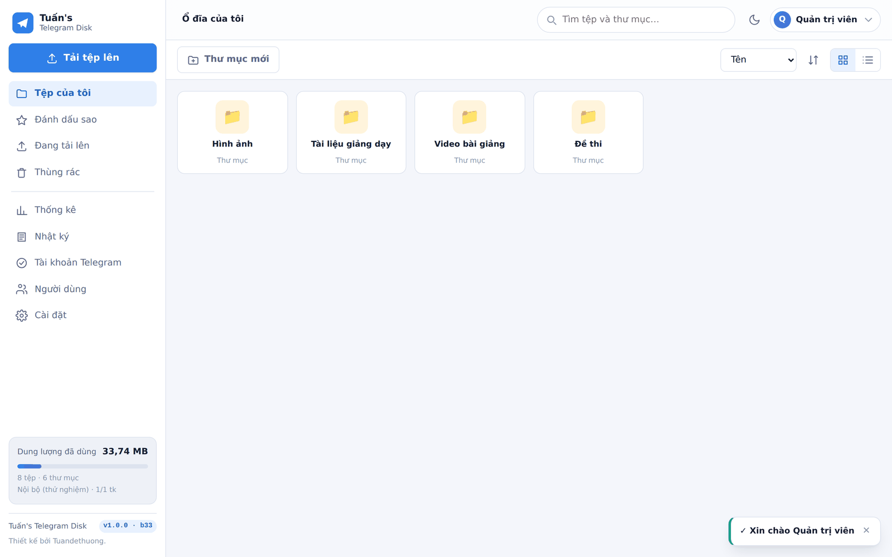

# Tuấn's Telegram Disk

> Ổ đĩa lưu trữ "không giới hạn" dùng Telegram làm nơi chứa dữ liệu.
> Viết hoàn toàn bằng C++17, chạy độc lập, không cần cài thêm gì.

**Thiết kế bởi Tuandethuong.**

📖 **[Hướng dẫn sử dụng](docs/HUONG-DAN-SU-DUNG.md)** — từ lúc cài đặt tới khi
gắn ổ đĩa vào máy tính, kèm ảnh chụp từng bước.
🔧 **[Quy trình kỹ thuật](docs/QUY-TRINH-KY-THUAT.md)** — kiến trúc, đường đi của
dữ liệu, MTProto, kèm sơ đồ.



---

## Ứng dụng làm được gì

| | |
|---|---|
| 🗄️ **Lưu trữ trên Telegram** | Cắt tệp thành từng mảnh rồi gửi vào siêu nhóm riêng của bạn. Kích thước mảnh chỉnh được, mặc định 500 MB. |
| 👥 **Nhiều tài khoản** | Dùng nhiều tài khoản Telegram trong cùng một siêu nhóm. Mỗi mảnh giao cho tài khoản đang rảnh nhất để chia tải và tránh bị giới hạn tần suất. |
| ⬆️ **Tải lên theo luồng** | Trình duyệt gửi từng phần lên máy chủ, máy chủ đẩy thẳng lên Telegram. Tệp 100 GB vẫn tải được trên máy chỉ có 1 GB RAM. |
| 🔁 **Phát hiện tệp trùng** | Kiểm tra trước khi tải và hỏi bạn: giữ cả hai, dùng lại dữ liệu đã có, ghi đè, hay bỏ qua. |
| 🛑 **Huỷ an toàn** | Huỷ giữa chừng sẽ dừng ngay và xoá sạch những mảnh đã đẩy lên, không để lại rác. |
| 🎬 **Phát trực tuyến** | Hỗ trợ HTTP Range đầy đủ — xem phim, nghe nhạc, mở PDF ngay trong trình duyệt mà không cần tải hết tệp. |
| 📁 **WebDAV** | Gắn thành ổ đĩa mạng trong Windows Explorer, macOS Finder, Linux, hoặc mở trực tiếp bằng VLC / Kodi / PotPlayer. |
| 🗃️ **Hai loại cơ sở dữ liệu** | SQLite (một tệp, không cần cài gì) hoặc MySQL / MariaDB. Chọn trong phần Cài đặt. |
| 🇻🇳 **Giao diện tiếng Việt** | Toàn bộ giao diện, thông báo và nhật ký đều bằng tiếng Việt. Múi giờ UTC+7. |
| 📊 **Theo dõi đầy đủ** | Dung lượng đã dùng (cả con số trên giấy tờ lẫn dung lượng thật chiếm trên Telegram sau khi khử trùng lặp), tiến độ từng phiên tải lên, nhật ký thời gian thực ngay trên giao diện. |
| 🔒 **Nhiều người dùng** | Tài khoản riêng, hạn mức dung lượng riêng, phân quyền quản trị. |

---

## Cài đặt nhanh

### Windows 64-bit

1. Tải gói `tuan-telegram-disk-x.y.z-windows-x64.zip`, giải nén ra một thư mục cố định.
2. Bấm đúp vào **`chay.bat`**.
3. Cửa sổ dòng lệnh sẽ in ra **mật khẩu quản trị** — hãy chép lại.
4. Mở trình duyệt tới <http://127.0.0.1:8088>, đăng nhập bằng `admin` và mật khẩu đó.

### Debian / Ubuntu (amd64)

```bash
tar -xzf tuan-telegram-disk-x.y.z-linux-amd64.tar.gz
cd linux-amd64
./chay.sh
```

Mật khẩu quản trị được in ra ở lần chạy đầu tiên. Mở <http://127.0.0.1:8088>.

Chạy nền như một dịch vụ:

```bash
sudo mkdir -p /opt/tuan-telegram-disk
sudo cp -r ./* /opt/tuan-telegram-disk/
sudo useradd -r -s /usr/sbin/nologin ttd
sudo chown -R ttd:ttd /opt/tuan-telegram-disk
sudo cp tuan-telegram-disk.service /etc/systemd/system/
sudo systemctl enable --now tuan-telegram-disk
```

---

## Kết nối với Telegram

Ứng dụng khởi động ở **chế độ thử nghiệm** (lưu trên đĩa máy này) để bạn xem thử
giao diện ngay. Muốn lưu thật lên Telegram, làm bốn bước sau.

### 1. Lấy api_id và api_hash

Vào <https://my.telegram.org> → **API development tools** → tạo một ứng dụng.
Chép `api_id` và `api_hash` vào **Cài đặt → Telegram** rồi bấm **Lưu cài đặt**.
Đồng thời đổi **Nơi lưu trữ** thành *Telegram (lưu thật)*, sau đó khởi động lại ứng dụng.

> Mỗi người nên tự tạo `api_id` riêng. Dùng chung `api_id` phổ biến dễ bị Telegram
> chặn với lỗi `API_ID_PUBLISHED_FLOOD`.

### 2. Tạo siêu nhóm lưu trữ

Trong ứng dụng Telegram: tạo một **nhóm mới** → đổi thành **siêu nhóm** (chỉ cần bật
lịch sử cho thành viên mới, hoặc đặt tên người dùng công khai). Đặt ở chế độ riêng tư,
đừng mời ai ngoài các tài khoản bạn sẽ dùng.

### 3. Thêm tài khoản Telegram

**Tài khoản Telegram → ＋ Thêm tài khoản**: nhập số điện thoại → nhập mã Telegram gửi
tới → nếu tài khoản bật xác thực hai lớp thì nhập thêm mật khẩu đám mây.
Lặp lại cho từng tài khoản muốn dùng. Nhớ mời tất cả vào siêu nhóm ở bước 2.

### 4. Chọn siêu nhóm

Vẫn ở trang đó, bấm **Liệt kê nhóm** rồi chọn siêu nhóm, hoặc dán `@ten_nhom` /
`t.me/...` / mã số nhóm vào ô rồi bấm **Lưu**.

Xong. Bây giờ mọi tệp tải lên đều được cắt mảnh và gửi vào siêu nhóm đó.

---

## Gắn ổ đĩa vào máy tính (WebDAV)

Địa chỉ: `http://<địa-chỉ-máy-chủ>:8088/webdav`
Đăng nhập bằng chính tài khoản web.

| Hệ điều hành | Cách làm |
|---|---|
| **Windows** | This PC → *Map network drive* → nhập địa chỉ WebDAV |
| **macOS** | Finder → *Go* → *Connect to Server* → nhập địa chỉ |
| **Linux** | Trình quản lý tệp: `dav://máy-chủ:8088/webdav`, hoặc dùng `davfs2` |
| **VLC / Kodi** | Mở địa chỉ mạng trỏ thẳng tới tệp — phát được ngay, không cần tải về |

> Windows chỉ chấp nhận WebDAV qua HTTP khi máy chủ nằm trên chính máy đó.
> Truy cập từ máy khác nên đặt ứng dụng sau một proxy có HTTPS (nginx, Caddy…).

---

## Cấu hình

Mọi thiết lập nằm trong `config.json` cạnh tệp thực thi và **sửa được trực tiếp
trong giao diện web** (Cài đặt). Vài mục đáng chú ý:

### Lưu trữ

| Khoá | Mặc định | Ý nghĩa |
|---|---|---|
| `storage.chunk_size` | `500MB` | Kích thước mỗi mảnh gửi lên Telegram. Tối đa khoảng 1900 MB. |
| `storage.buffer_mode` | `stream` | `stream`: đẩy thẳng lên Telegram, tốn rất ít RAM. `memory`: giữ trọn mảnh trong RAM. `disk`: ghi ra tệp tạm — hợp với máy ít RAM nhưng đủ đĩa. |
| `storage.browser_chunk_size` | `8MB` | Mỗi lần trình duyệt gửi lên máy chủ bao nhiêu byte. |
| `storage.parallel_chunks` | `2` | Số mảnh xử lý song song (mỗi mảnh một tài khoản). |
| `storage.deduplicate` | `true` | Tệp trùng nội dung sẽ dùng lại dữ liệu cũ, không tốn thêm dung lượng. |
| `storage.download_cache_bytes` | `256MB` | Bộ nhớ đệm khối 1 MB giúp tua video mượt. |
| `storage.trash_retention_days` | `30` | Số ngày giữ tệp trong thùng rác. |

**Chọn `buffer_mode` thế nào?**

- Máy ít RAM (VPS 512 MB – 1 GB) → `stream`. RAM dùng chỉ khoảng 512 KB mỗi mảnh.
- Máy nhiều RAM, muốn giải phóng trình duyệt sớm → `memory`.
- Máy ít RAM nhưng nhiều đĩa, đường mạng tới Telegram chậm → `disk`.

### Cơ sở dữ liệu

```jsonc
"database": {
  "kind": "sqlite",                    // hoặc "mysql"
  "sqlite_path": "data/tuan-telegram-disk.db",
  "mysql_host": "127.0.0.1",
  "mysql_port": 3306,
  "mysql_user": "ttd",
  "mysql_password": "…",
  "mysql_database": "tuan_telegram_disk"
}
```

Trình điều khiển MySQL được viết trực tiếp theo giao thức mạng của MySQL nên
**không cần cài `libmysqlclient`**. Hỗ trợ cả `mysql_native_password` và
`caching_sha2_password` (MySQL 8). Tạo cơ sở dữ liệu trước khi dùng:

```sql
CREATE DATABASE tuan_telegram_disk
  CHARACTER SET utf8mb4 COLLATE utf8mb4_unicode_ci;
CREATE USER 'ttd'@'localhost' IDENTIFIED BY 'mật-khẩu';
GRANT ALL ON tuan_telegram_disk.* TO 'ttd'@'localhost';
```

Đổi loại cơ sở dữ liệu cần khởi động lại ứng dụng. Dữ liệu **không** tự chuyển
giữa hai loại.

---

## Tuỳ chọn dòng lệnh

```
tuan-telegram-disk [tuỳ chọn]

  -c, --config <tệp>     Đường dẫn tệp cấu hình
      --data <thư mục>   Thư mục dữ liệu gốc
      --check-schema     Kiểm tra tệp schema TL rồi thoát
      --print-config     In cấu hình hiện tại rồi thoát
  -v, --version          In phiên bản
  -h, --help             Trợ giúp
```

---

## Tự biên dịch

### Debian / Ubuntu

```bash
sudo apt install build-essential cmake
./build-linux.sh
# Kết quả: dist/linux-amd64/tuan-telegram-disk
```

### Windows x64 (biên dịch chéo từ Linux)

```bash
sudo apt install mingw-w64 cmake
./build-windows.sh
# Kết quả: dist/windows-x64/tuan-telegram-disk.exe
```

Script tự kiểm tra tệp `.exe` chỉ phụ thuộc DLL có sẵn trong Windows
(`kernel32`, `msvcrt`, `ws2_32`, `iphlpapi`, `bcrypt`) — không cần cài runtime nào.

### Chạy bộ tự kiểm tra

```bash
./build/ttd_selftest
```

Gần 200 phép kiểm tra: mật mã (đối chiếu vector chuẩn FIPS/RFC), số nguyên lớn,
schema TL, MTProto, HTTP, WebDAV Range, cơ sở dữ liệu, cấu hình.

### Đánh số phiên bản

Số build **tự tăng sau mỗi lần biên dịch** và hiện trên giao diện. Tăng phiên bản:

```bash
cmake --build build --target bump_patch   # 1.0.0 → 1.0.1
cmake --build build --target bump_minor   # 1.0.1 → 1.1.0
cmake --build build --target bump_major   # 1.1.0 → 2.0.0
```

---

## Cấu trúc mã nguồn

```
src/
  common/     JSON, chuỗi, thời gian UTC+7, nhật ký, cấu hình, socket, DNS
  crypto/     SHA-1/256/512, MD5, HMAC, PBKDF2, AES (IGE/CTR/CBC),
              số nguyên lớn (Montgomery), RSA (PKCS#1 v1.5 + OAEP), SRP
  compress/   Giải nén DEFLATE / zlib / gzip
  tg/         Tầng TL chạy theo schema, MTProto 2.0, tài khoản, nhóm tài khoản
  db/         Giao diện chung + SQLite + trình điều khiển MySQL tự viết
  storage/    Cắt mảnh, vùng đệm, phiên tải lên, bộ nhớ đệm khối, đọc dải byte
  http/       Máy chủ HTTP/1.1, API, WebDAV, tài nguyên nhúng
  app/        Ứng dụng, người dùng, hệ thống tệp ảo
schema/       mtproto.tl và api.tl (mô tả giao thức Telegram)
web/          Giao diện web (nhúng thẳng vào tệp thực thi khi biên dịch)
third_party/  SQLite 3.45.1 (bản amalgamation, kèm bản vá bảo mật)
```

Toàn bộ phần mật mã, nén, mạng, cơ sở dữ liệu MySQL và máy chủ HTTP đều **tự cài
đặt**, nên tệp thực thi không phụ thuộc OpenSSL, zlib hay libmysqlclient.

---

## Về tệp schema Telegram

Giao thức Telegram (TL) mô tả trong `schema/mtproto.tl` và `schema/api.tl`.
`api.tl` là bản chính thức lấy từ mã nguồn mở Telegram Desktop (**layer 229**,
2511 hàm dựng); ứng dụng đọc số layer ngay trong tệp rồi khai đúng số đó với máy
chủ, nên hai bên luôn dùng chung một bộ hàm dựng.

Định danh mỗi hàm dựng được tính bằng **CRC32 của chuỗi khai báo đã chuẩn hoá**,
theo đúng quy tắc của Telegram:

1. Bỏ hẳn các trường điều kiện dạng `tên:flags.N?true`
2. Đổi `<` `>` `{` `}` thành khoảng trắng rồi gộp khoảng trắng
3. Đổi kiểu `bytes` thành `string` (chỉ ở vị trí kiểu, không đổi tên trường)
4. CRC32 của chuỗi thu được

Quy tắc này đã được đối chiếu với toàn bộ schema chính thức: **2503/2511** hàm
dựng khớp CRC32. Tám hàm dựng còn lại là những chỗ Telegram cố tình giữ định
danh cũ sau khi đổi trường — ứng dụng ưu tiên định danh ghi trong tệp và chỉ ghi
một dòng cảnh báo.

Nhờ vậy, khi Telegram nâng layer bạn **không cần biên dịch lại**: chỉ việc đặt tệp
`api.tl` mới vào thư mục `schema/` cạnh tệp thực thi (hoặc trỏ tới nó bằng
`telegram.schema_file`); layer khai với máy chủ sẽ tự bám theo tệp mới. Kiểm tra
bằng:

```bash
./tuan-telegram-disk --check-schema
```

Bộ giải mã còn hỗ trợ **giải mã một phần**: nếu gặp hàm dựng lạ ở trường lồng bên
trong, những trường đã đọc được vẫn giữ nguyên, nên đường tải lên/tải xuống vẫn
chạy ngay cả khi schema lệch đôi chút so với máy chủ. Lưu ý TL không tự mô tả độ
dài, nên hàm dựng lạ nằm giữa một danh sách sẽ làm mất phần đứng sau nó — vì thế
hãy giữ `api.tl` cập nhật thay vì trông cậy vào giải mã một phần.

---

## Bảo mật

- Mật khẩu người dùng băm bằng PBKDF2-HMAC-SHA256, 120 000 vòng, muối ngẫu nhiên.
- Phiên đăng nhập dùng mã ngẫu nhiên 256-bit trong cookie `HttpOnly`, `SameSite=Lax`.
- Khoá phiên Telegram (`auth_key`) lưu trong cơ sở dữ liệu — **hãy bảo vệ tệp
  `data/` và cơ sở dữ liệu như bảo vệ mật khẩu**, vì ai có khoá đó đều truy cập
  được tài khoản Telegram của bạn.
- Tệp do người dùng tải lên không bao giờ được hiển thị inline nếu là HTML, SVG
  hay JavaScript, để tránh chạy mã độc trên cùng tên miền.
- Truy vấn MySQL đều đi qua hàm thoát chuỗi có kiểm thử riêng; SQLite dùng câu
  lệnh tham số hoá.
- Ứng dụng chỉ nói HTTP. Nếu mở ra Internet, **hãy đặt sau một proxy có HTTPS**.

---

## Giới hạn cần biết

- Telegram giới hạn mỗi tệp khoảng **2 GB** với tài khoản thường (4 GB với
  Telegram Premium), nên kích thước mảnh tối đa là 1900 MB.
- Tham chiếu tệp (`file_reference`) của Telegram hết hạn sau vài giờ; ứng dụng tự
  làm mới khi tải xuống, nên bạn không cần quan tâm.
- Nếu tài khoản bị Telegram giới hạn tần suất (`FLOOD_WAIT`), ứng dụng tự chuyển
  sang tài khoản khác và ghi rõ thời gian chờ trong nhật ký.
- Xoá tệp khỏi siêu nhóm bằng ứng dụng Telegram sẽ làm mất dữ liệu — hãy để
  ứng dụng này quản lý.

---

## Giấy phép

MIT. Xem tệp `LICENSE`.

---

<p align="center"><sub>Thiết kế bởi Tuandethuong.</sub></p>
