# Hướng dẫn sử dụng — Tuấn's Telegram Disk

Ổ đĩa lưu trữ dùng Telegram làm nơi chứa dữ liệu. Tài liệu này đi từ lúc tải gói
cài đặt cho tới khi gắn ổ đĩa vào máy tính, kèm ảnh chụp từng bước.

Muốn hiểu bên trong hoạt động ra sao, xem
[Quy trình kỹ thuật](QUY-TRINH-KY-THUAT.md).

> Ảnh trong tài liệu chụp từ ứng dụng chạy thật, dùng dữ liệu mẫu. Số điện thoại
> và khoá bí mật đều là giá trị giả.

---

## Mục lục

1. [Cài đặt](#1-cài-đặt)
2. [Đăng nhập lần đầu](#2-đăng-nhập-lần-đầu)
3. [Kết nối Telegram](#3-kết-nối-telegram)
4. [Quản lý tệp](#4-quản-lý-tệp)
5. [Tải tệp lên](#5-tải-tệp-lên)
6. [Khi trùng tệp](#6-khi-trùng-tệp)
7. [Thùng rác](#7-thùng-rác)
8. [Gắn ổ đĩa vào máy tính (WebDAV)](#8-gắn-ổ-đĩa-vào-máy-tính-webdav)
9. [Người dùng](#9-người-dùng)
10. [Cài đặt](#10-cài-đặt)
11. [Theo dõi hệ thống](#11-theo-dõi-hệ-thống)
12. [Dùng trên điện thoại](#12-dùng-trên-điện-thoại)
13. [Sự cố thường gặp](#13-sự-cố-thường-gặp)

---

## 1. Cài đặt

Ứng dụng là **một tệp thực thi duy nhất**. Không cần cài .NET, Java, Python hay
bất cứ runtime nào.

### Windows 64-bit

1. Giải nén `tuan-telegram-disk-x.y.z-windows-x64.zip` ra một thư mục cố định,
   ví dụ `C:\TelegramDisk`. Đừng để trong `Downloads` — ứng dụng sẽ tạo thư mục
   dữ liệu ngay cạnh tệp thực thi.
2. Bấm đúp **`chay.bat`**.
3. Lần đầu chạy, Windows hỏi cho phép truy cập mạng — chọn **Cho phép** nếu muốn
   vào ổ đĩa từ máy khác trong mạng nội bộ.

Muốn chạy ngầm như một dịch vụ, dùng [NSSM](https://nssm.cc):

```bat
nssm install TuanTelegramDisk C:\TelegramDisk\tuan-telegram-disk.exe
nssm set TuanTelegramDisk AppDirectory C:\TelegramDisk
nssm start TuanTelegramDisk
```

### Debian / Ubuntu (amd64)

```bash
tar -xzf tuan-telegram-disk-x.y.z-linux-amd64.tar.gz
cd linux-amd64
./chay.sh
```

Chạy ngầm bằng systemd:

```bash
sudo mkdir -p /opt/tuan-telegram-disk
sudo cp -r ./* /opt/tuan-telegram-disk/
sudo useradd -r -s /usr/sbin/nologin ttd
sudo chown -R ttd:ttd /opt/tuan-telegram-disk
sudo cp tuan-telegram-disk.service /etc/systemd/system/
sudo systemctl enable --now tuan-telegram-disk
```

---

## 2. Đăng nhập lần đầu

Lần chạy đầu tiên, cửa sổ dòng lệnh in ra mật khẩu quản trị:

```
==============================================================
 Tài khoản quản trị đầu tiên đã được tạo:
   Tên đăng nhập: admin
   Mật khẩu     : F7Yc-xfCu-tc6A-n3A7
 Hãy đăng nhập và đổi mật khẩu ngay.
==============================================================
```

Chép mật khẩu đó rồi mở <http://127.0.0.1:8088>.

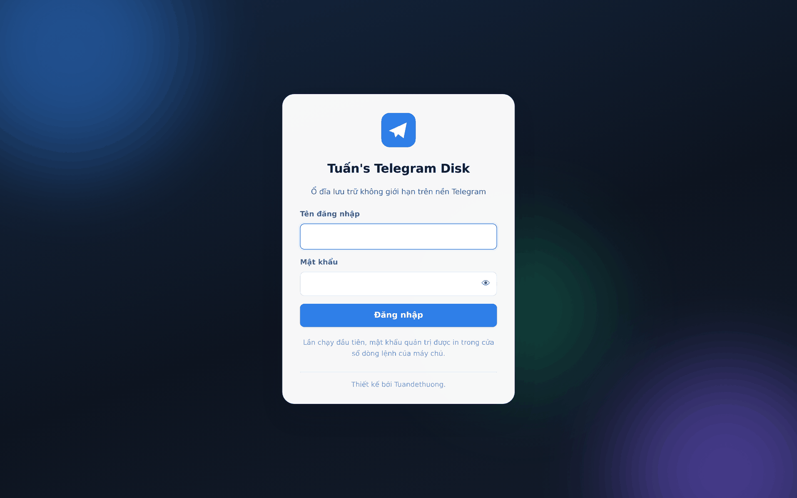

Đăng nhập xong, **đổi mật khẩu ngay** ở menu góc trên bên phải.

---

## 3. Kết nối Telegram

Mới cài xong, ứng dụng chạy ở **chế độ thử nghiệm** — dữ liệu lưu trên đĩa máy
này để bạn xem thử giao diện. Muốn lưu thật lên Telegram thì làm bốn bước sau.

### Bước 1 — Lấy api_id và api_hash

Vào <https://my.telegram.org> → **API development tools** → tạo một ứng dụng.
Điền `api_id` và `api_hash` vào **Cài đặt → Telegram**, đổi **Nơi lưu trữ** thành
*Telegram (lưu thật)*, rồi bấm **Lưu cài đặt**.

> Mỗi người nên tự tạo `api_id` riêng. Dùng chung một `api_id` phổ biến rất dễ
> bị Telegram chặn với lỗi `API_ID_PUBLISHED_FLOOD`.

### Bước 2 — Tạo siêu nhóm lưu trữ

Trong ứng dụng Telegram: tạo **nhóm mới**, rồi nâng thành **siêu nhóm**
(supergroup) — chỉ cần bật "hiện lịch sử cho thành viên mới" hoặc đặt tên người
dùng công khai là nhóm tự chuyển thành siêu nhóm.

Đặt nhóm ở chế độ **riêng tư** và đừng mời ai ngoài các tài khoản bạn sẽ dùng.

> Nhóm thường sẽ **không** hiện trong danh sách. Ứng dụng chỉ nhận siêu nhóm.

### Bước 3 — Thêm tài khoản Telegram

Vào **Tài khoản Telegram → ＋ Thêm tài khoản**:

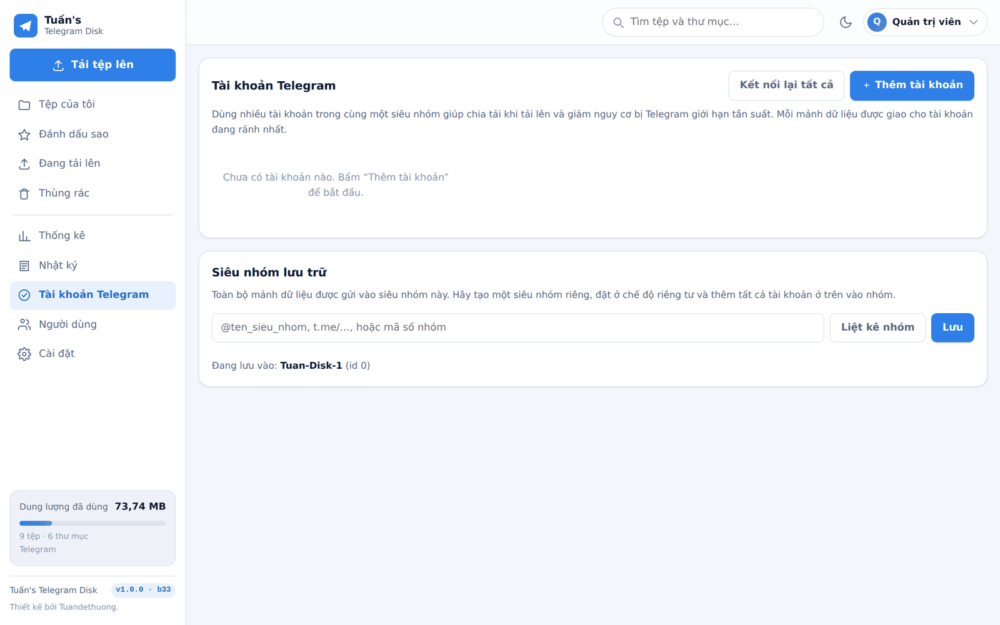

Nhập tên gợi nhớ và số điện thoại kèm mã quốc gia:

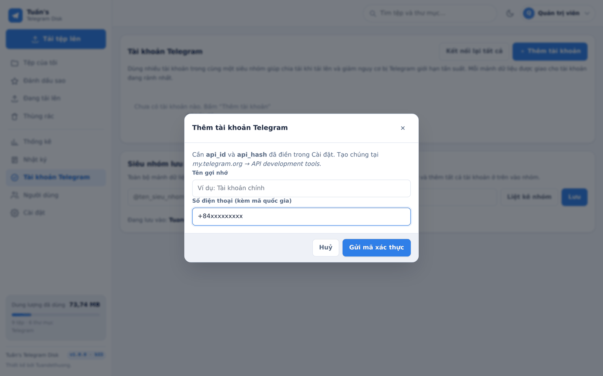

Telegram gửi mã xác thực tới ứng dụng Telegram trên máy khác của bạn. Nhập mã;
nếu tài khoản có bật xác thực hai lớp thì nhập thêm mật khẩu đám mây.

Lặp lại cho từng tài khoản muốn dùng. **Nhớ mời tất cả vào siêu nhóm ở bước 2** —
tài khoản không ở trong nhóm sẽ không gửi và không đọc được dữ liệu.

### Bước 4 — Chọn siêu nhóm

Vẫn ở trang đó, phần **Siêu nhóm lưu trữ**: bấm **Liệt kê nhóm** rồi chọn, hoặc
dán `@ten_nhom` / `t.me/...` / mã số nhóm vào ô rồi bấm **Lưu**.

Xong. Từ giờ mọi tệp tải lên đều được cắt mảnh và gửi vào siêu nhóm đó.

---

## 4. Quản lý tệp

Màn hình chính là **Tệp của tôi**:


Vào trong thư mục:

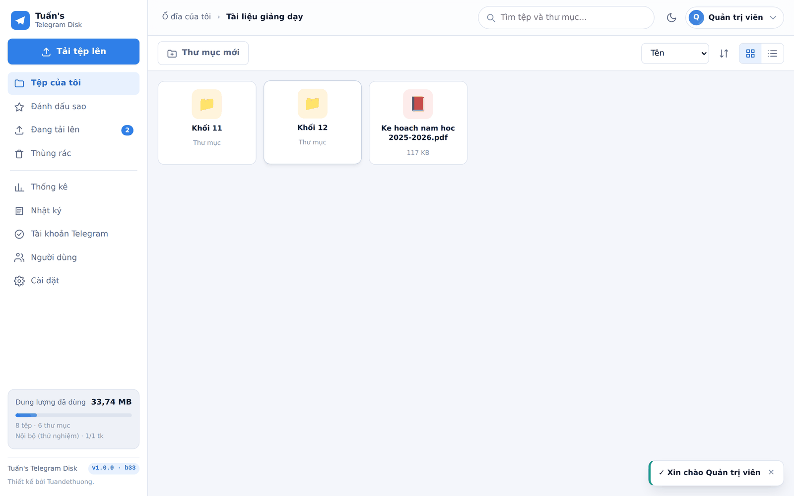

Đổi sang **dạng danh sách** ở góc trên bên phải để thấy kích thước, ngày sửa và
số mảnh:

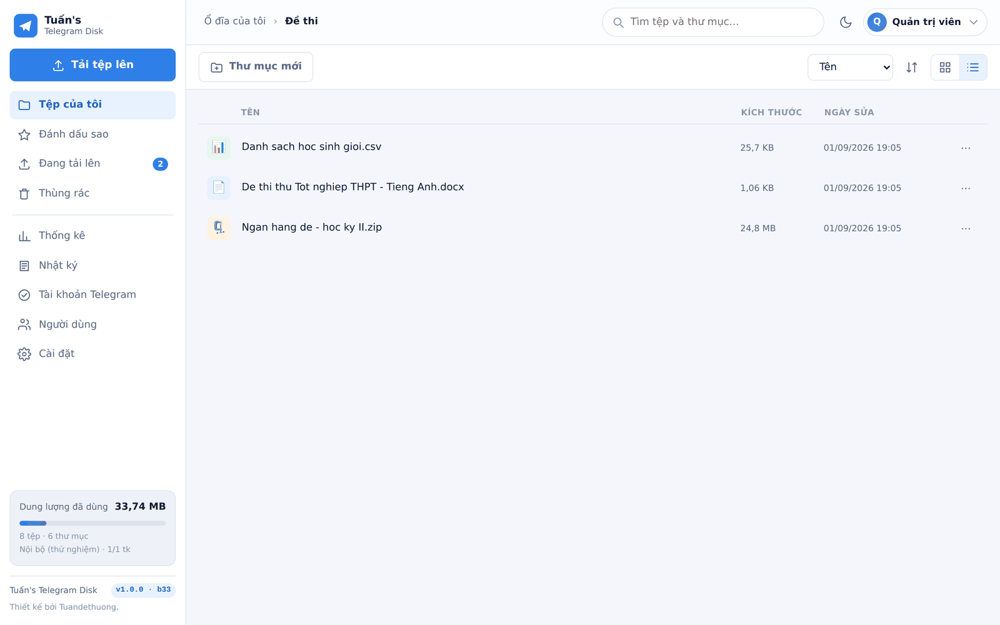

Bấm đúp vào ảnh, PDF hay video để **xem trước ngay trong trình duyệt** — không
cần tải về:

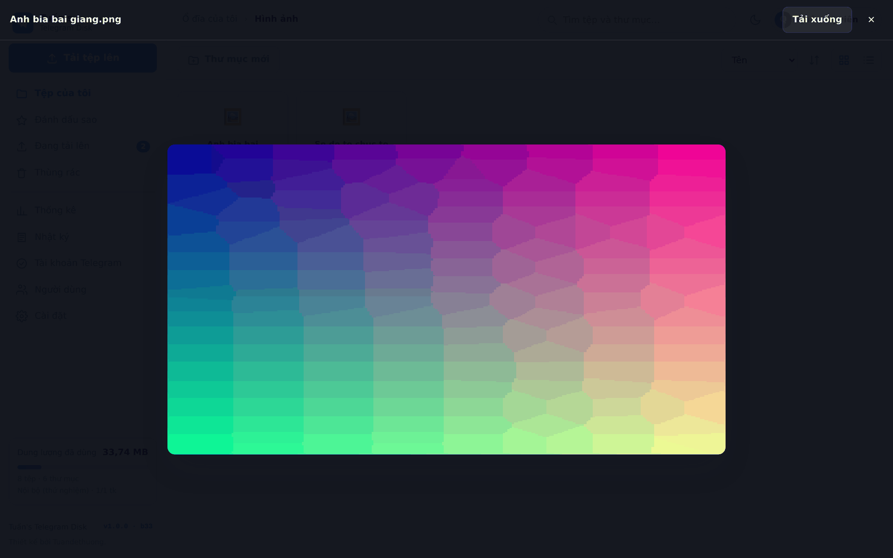

Những thao tác có sẵn:

| Thao tác | Cách làm |
|---|---|
| Tạo thư mục | Nút **Thư mục mới** |
| Đổi tên, di chuyển, sao chép | Menu **⋯** trên từng mục |
| Chọn nhiều | Giữ `Ctrl` (hoặc `⌘`) rồi bấm, hoặc kéo khung chọn |
| Đánh dấu sao | Biểu tượng ☆ — xem lại ở mục **Đánh dấu sao** |
| Ghi chú | Menu **⋯ → Ghi chú** |
| Chia sẻ công khai | Menu **⋯ → Chia sẻ** — tạo liên kết ai có cũng mở được |
| Tìm kiếm | Ô tìm ở trên cùng, tìm cả cây thư mục, **có dấu và không phân biệt hoa thường** |
| Sắp xếp | Ô chọn cạnh nút đổi dạng hiển thị |

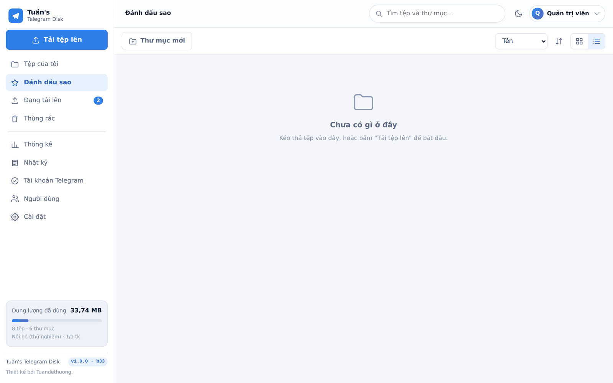

---

## 5. Tải tệp lên

Bấm **Tải tệp lên**, hoặc kéo thả tệp thẳng vào cửa sổ trình duyệt.

Trong lúc tải, mục **Đang tải lên** hiện tiến độ thật: đã gửi bao nhiêu, đang ở
mảnh thứ mấy, tài khoản Telegram nào đang gửi, tốc độ và thời gian còn lại.


Xong thì thẻ chuyển sang **Hoàn tất** và tự biến mất sau vài giây:

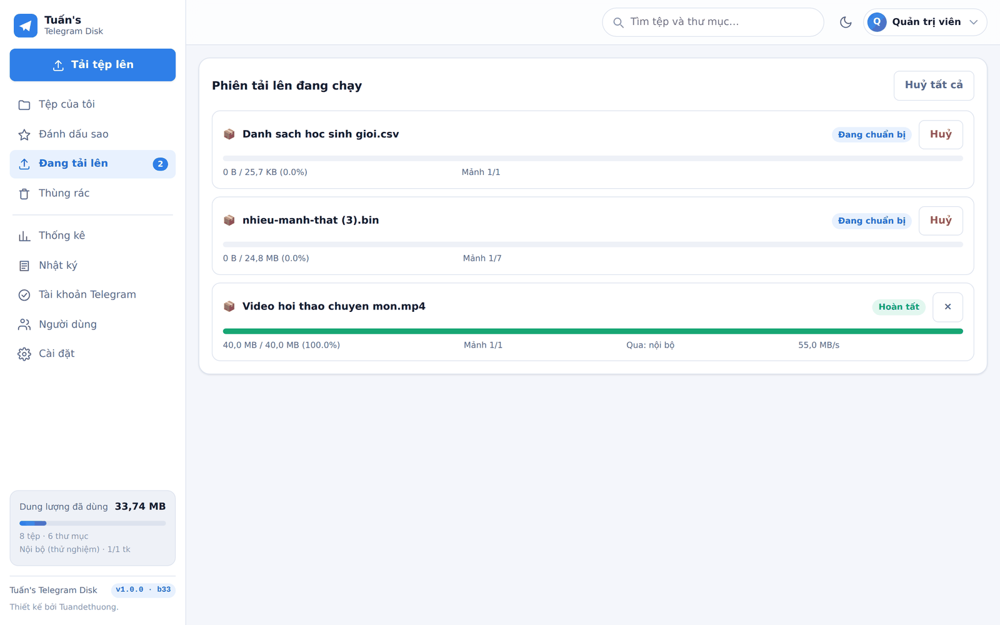

### Huỷ giữa chừng

Bấm **Huỷ** trên thẻ đang chạy. Những mảnh đã đẩy lên Telegram sẽ bị **xoá sạch**
— không để lại rác.

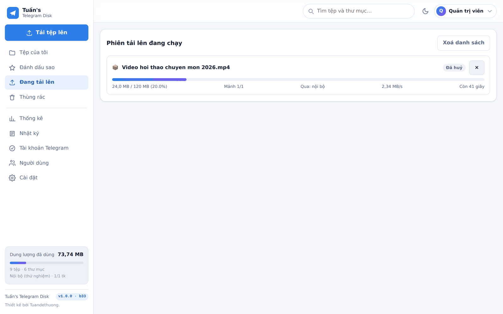

Đóng tab giữa chừng cũng vậy: trình duyệt báo cho máy chủ trước khi đóng. Còn
nếu rớt mạng hẳn thì phiên bị bỏ dở sẽ tự được dọn sau 30 phút.

### Tệp lớn hơn RAM

Không thành vấn đề. Trình duyệt gửi từng phần 8 MB, máy chủ nhận được bao nhiêu
đẩy thẳng lên Telegram bấy nhiêu — không giữ trọn tệp ở đâu cả. Máy 1 GB RAM
vẫn tải được tệp 100 GB.

Máy quá ít RAM thì đổi **Chế độ đệm** sang `disk` trong Cài đặt.

---

## 6. Khi trùng tệp

Trước khi tải, ứng dụng băm nhanh 64 KB đầu tệp và tra xem đã có tệp nào giống
chưa. Có thì hỏi:

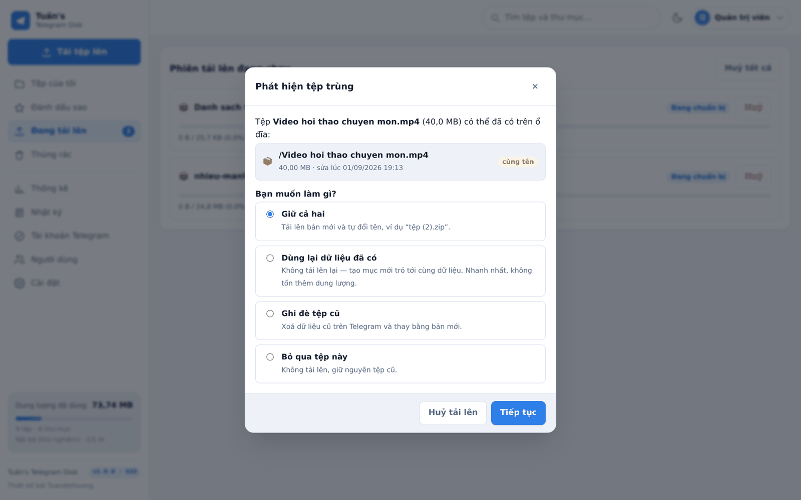

| Lựa chọn | Ý nghĩa |
|---|---|
| **Giữ cả hai** | Tải lên bản mới, tự đổi tên thành `tệp (2).zip` |
| **Dùng lại dữ liệu đã có** | Không tải lại. Tạo mục mới trỏ tới cùng dữ liệu — nhanh nhất, **không tốn thêm dung lượng** |
| **Ghi đè tệp cũ** | Xoá mảnh cũ trên Telegram, thay bằng bản mới |
| **Bỏ qua tệp này** | Không làm gì |

Ngoài ra, sau khi tải xong ứng dụng còn đối chiếu SHA-256 của **toàn bộ** tệp.
Hai tệp khác tên nhưng nội dung y hệt vẫn bị phát hiện và tự động gộp lại dùng
chung một bộ mảnh.

Không muốn hỏi nữa? Tắt **Khử trùng lặp** trong Cài đặt.

---

## 7. Thùng rác

Xoá tệp là đưa vào thùng rác, chưa đụng gì tới dữ liệu trên Telegram.

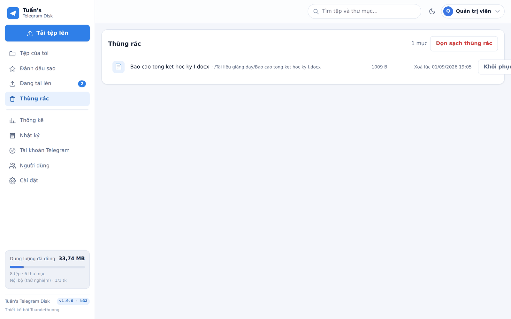

Từ đây có thể **Khôi phục** hoặc **Xoá hẳn**. Chỉ khi xoá hẳn thì các mảnh mới
bị gỡ khỏi Telegram — và chỉ gỡ những mảnh không còn tệp nào khác dùng chung.

Mặc định thùng rác tự dọn sau **30 ngày** (đổi được trong Cài đặt).

---

## 8. Gắn ổ đĩa vào máy tính (WebDAV)

Địa chỉ: `http://<địa-chỉ-máy-chủ>:8088/webdav`
Đăng nhập bằng chính tài khoản web.

| Hệ điều hành | Cách làm |
|---|---|
| **Windows** | This PC → *Map network drive* → nhập địa chỉ WebDAV |
| **macOS** | Finder → *Go* → *Connect to Server* → nhập địa chỉ |
| **Linux** | Trình quản lý tệp: `dav://máy-chủ:8088/webdav`, hoặc dùng `davfs2` |
| **VLC / Kodi / PotPlayer** | Mở địa chỉ mạng trỏ thẳng tới tệp — phát được ngay, không cần tải về |

Vì hỗ trợ đầy đủ HTTP Range nên **tua video chạy được**: trình phát chỉ xin đúng
đoạn nó cần, ứng dụng chỉ đọc đúng những mảnh chứa đoạn đó.

> Windows chỉ chấp nhận WebDAV qua HTTP khi máy chủ nằm trên chính máy đó. Truy
> cập từ máy khác nên đặt ứng dụng sau proxy có HTTPS (nginx, Caddy…).

---

## 9. Người dùng

Quản trị viên tạo được thêm tài khoản, đặt hạn mức dung lượng riêng cho từng
người:

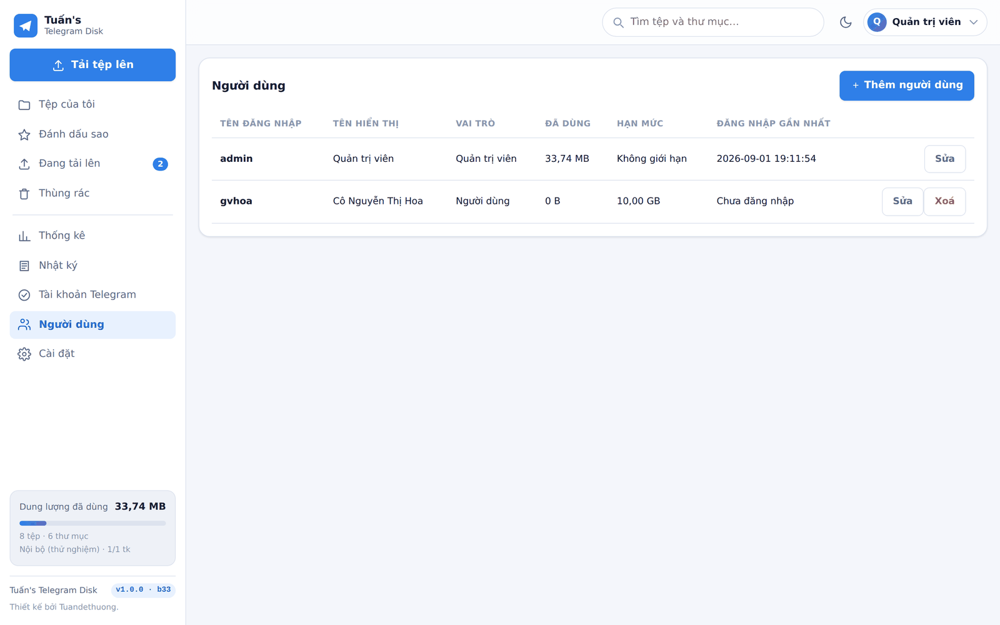

Người dùng thường **chỉ thấy tệp của chính mình**. Quản trị viên thấy tất cả.

---

## 10. Cài đặt

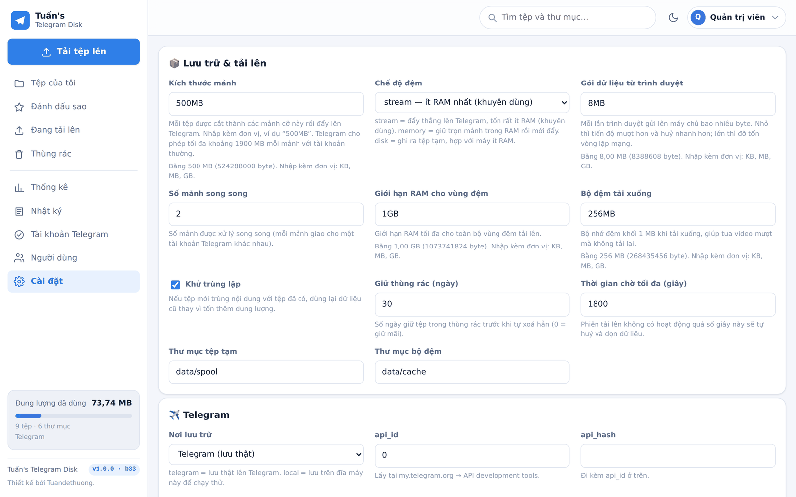

Những mục hay dùng nhất:

| Mục | Mặc định | Ý nghĩa |
|---|---|---|
| **Kích thước mảnh** | 500 MB | Mỗi mảnh gửi lên Telegram lớn bao nhiêu. Tối đa ~1900 MB |
| **Chế độ đệm** | `stream` | `stream` tốn rất ít RAM · `memory` giữ trọn mảnh trong RAM · `disk` ghi ra tệp tạm |
| **Cỡ khối trình duyệt gửi** | 8 MB | Mỗi lần trình duyệt gửi lên máy chủ bao nhiêu byte |
| **Số mảnh song song** | 2 | Bao nhiêu mảnh xử lý cùng lúc (mỗi mảnh một tài khoản) |
| **Khử trùng lặp** | Bật | Tệp trùng nội dung dùng lại dữ liệu cũ |
| **Bộ đệm tải xuống** | 256 MB | Đệm khối 1 MB giúp tua video mượt. **Đây cũng chính là mức RAM ứng dụng dùng khi có người tải tệp** — máy ít RAM thì hạ xuống 32–64 MB |
| **Số ngày giữ thùng rác** | 30 | |
| **Nơi lưu trữ** | Telegram | Đổi sang *nội bộ* để chạy thử không cần Telegram |
| **Cơ sở dữ liệu** | SQLite | Hoặc MySQL/MariaDB. Đổi xong phải khởi động lại |

Đổi cỡ mảnh chỉ ảnh hưởng tệp tải lên **sau đó**. Tệp cũ giữ nguyên cách cắt cũ
và vẫn đọc bình thường.

---

## 11. Theo dõi hệ thống

### Thống kê

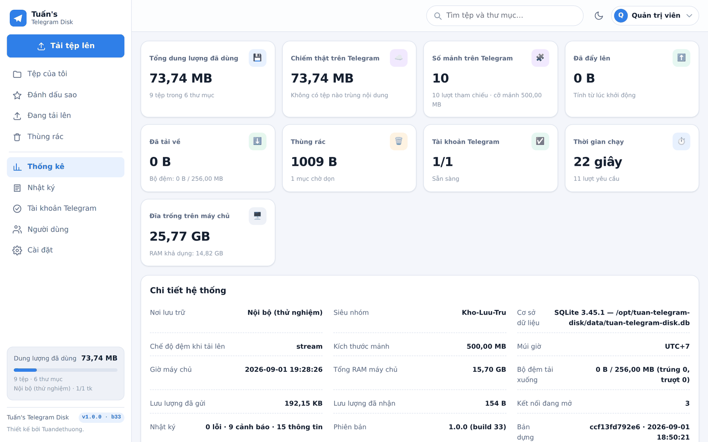

Hai con số dung lượng khác nhau, đừng nhầm:

- **Tổng dung lượng đã dùng** — cộng kích thước từng tệp, con số "trên giấy tờ"
- **Chiếm thật trên Telegram** — dung lượng thật sự chiếm, sau khi trừ phần dùng
  chung giữa các tệp trùng nội dung

Hai tệp 5 MB giống hệt nhau ⇒ 10 MB trên giấy tờ nhưng chỉ 5 MB thật.

### Nhật ký

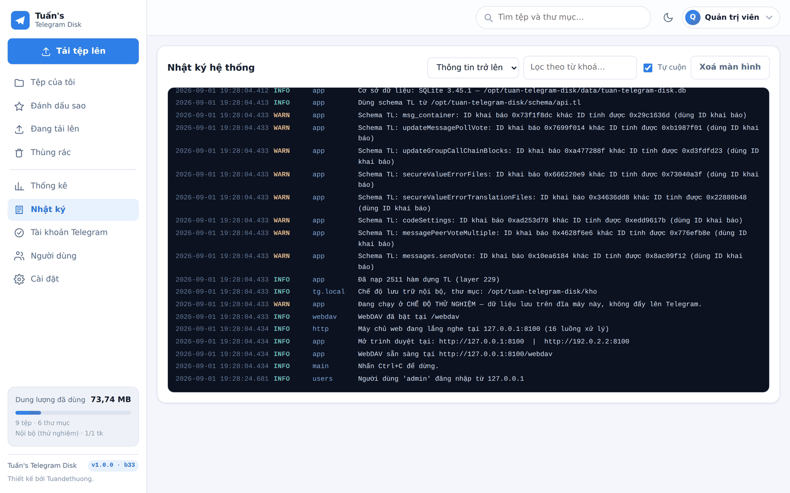

Nhật ký chảy theo thời gian thực, lọc được theo mức. Gặp trục trặc thì đổi mức
sang `debug` trong Cài đặt rồi làm lại thao tác lỗi — nhật ký sẽ nói rõ ứng dụng
gửi gì lên Telegram và nhận về gì.

### Giao diện tối

Bấm biểu tượng mặt trăng trên thanh trên cùng:

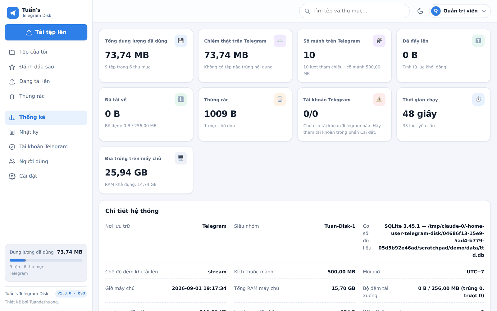

---

## 12. Dùng trên điện thoại

Giao diện tự co theo màn hình nhỏ:

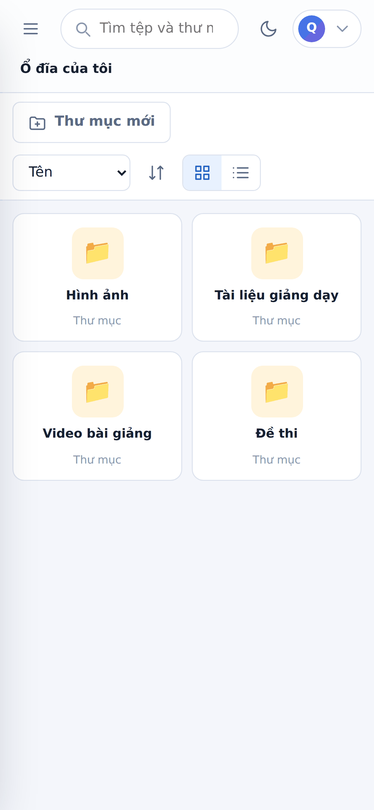

---

## 13. Sự cố thường gặp

### `CONNECTION_API_ID_INVALID` khi thêm tài khoản

`api_id` gửi lên Telegram không hợp lệ. Kiểm tra lại **Cài đặt → Telegram**:
`api_id` phải là **dãy số**, `api_hash` là chuỗi 32 ký tự hex. Rất dễ dán nhầm
cái nọ sang ô kia.

Nhật ký in ra `api_id` đang thực sự dùng lúc đăng nhập — đối chiếu với
my.telegram.org:

```
[app] [Tài khoản 1] Đăng nhập với api_id 12345678 (api_hash 32 ký tự), layer 229
```

### `API_ID_PUBLISHED_FLOOD`

`api_id` đang dùng bị Telegram hạn chế vì quá nhiều người xài chung. Tự tạo
`api_id` riêng tại my.telegram.org.

### Bấm "Liệt kê nhóm" mà không thấy nhóm nào

- Nhóm phải là **siêu nhóm**, không phải nhóm thường
- Tài khoản Telegram đã thêm phải **là thành viên** của nhóm đó
- Nhật ký có dòng cảnh báo `Hàm dựng lạ` ⇒ tệp `schema/api.tl` đã cũ. Tải bản
  `api.tl` mới đè lên rồi khởi động lại, kiểm tra bằng
  `./tuan-telegram-disk --check-schema`

### `CHANNEL_INVALID` khi tải tệp lớn

Nếu bạn đang chạy bản cũ hơn build 37: tệp nhỏ (một mảnh) thì lên bình thường,
tệp lớn (nhiều mảnh) lại hỏng giữa chừng ở mảnh thứ hai trở đi. Nguyên nhân là
`access_hash` của siêu nhóm được Telegram cấp riêng cho từng tài khoản, mà bản
cũ dùng chung một hash cho mọi tài khoản. **Cập nhật lên bản mới là hết.**

Bản mới in ra dòng này cho từng tài khoản ở lần dùng đầu tiên:

```
[tg.acc] [Tên tài khoản] Đã lấy access_hash riêng cho siêu nhóm 'Tên nhóm'
```

### "Tài khoản X chưa vào siêu nhóm lưu trữ"

Đúng như thông báo: tài khoản đó chưa phải thành viên nhóm. Mở Telegram, mời nó
vào siêu nhóm ở bước 2, rồi bấm **Kết nối lại tất cả**. Ứng dụng sẽ tự bỏ qua
tài khoản này và dùng tài khoản khác trong lúc chờ, nên việc tải lên không bị
gián đoạn.

### `FLOOD_WAIT`

Telegram bắt chờ vì gửi quá nhanh. Ứng dụng tự chờ rồi thử lại. Bị thường xuyên
thì **thêm tài khoản** vào siêu nhóm để chia tải, hoặc **tăng cỡ mảnh** cho ít
tin nhắn hơn.

### Tải lên chậm

- Đặt máy chủ ở nơi có đường mạng tốt tới Telegram
- Thêm tài khoản và tăng **Số mảnh song song**
- Tăng **Cỡ khối trình duyệt gửi** nếu đường từ trình duyệt tới máy chủ nhanh

### Windows không gắn được ổ WebDAV

Windows chỉ chấp nhận WebDAV qua HTTP với máy cục bộ. Từ máy khác thì phải đặt
sau proxy có HTTPS.

### Quên mật khẩu quản trị

Dừng ứng dụng, xoá bản ghi người dùng khỏi cơ sở dữ liệu rồi chạy lại — ứng dụng
sẽ tạo tài khoản quản trị mới và in mật khẩu mới ra màn hình.

```bash
sqlite3 data/tuan-telegram-disk.db "DELETE FROM ttd_users WHERE username='admin';"
```

### Cần sao lưu những gì

| Thư mục / tệp | Nội dung | Quan trọng |
|---|---|---|
| `data/*.db` | **Bản đồ tệp → mảnh**, người dùng, khoá đăng nhập Telegram | Sống còn |
| `config.json` | Cấu hình, `api_id`, `api_hash` | Cao |
| `schema/` | Mô tả giao thức Telegram | Tải lại được |
| `logs/` | Nhật ký | Không cần |

**Mất cơ sở dữ liệu là mất bản đồ.** Dữ liệu vẫn nằm nguyên trên Telegram nhưng
thành một đống tệp rời không tên, không cách nào ghép lại. Hãy sao lưu `data/`
định kỳ.

Hai tệp `data/` và `config.json` chứa khoá đăng nhập Telegram và `api_hash` —
đối xử như mật khẩu, đừng đưa lên kho mã công khai.

---

**Thiết kế bởi Tuandethuong.**
