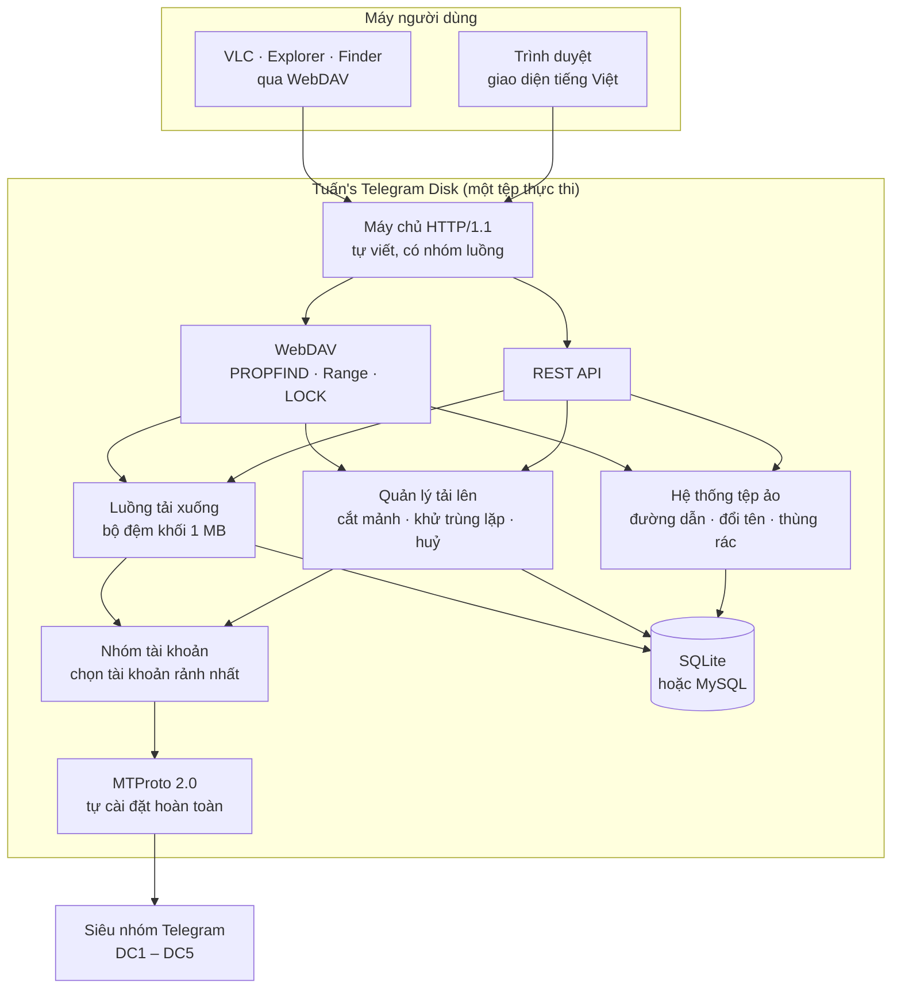
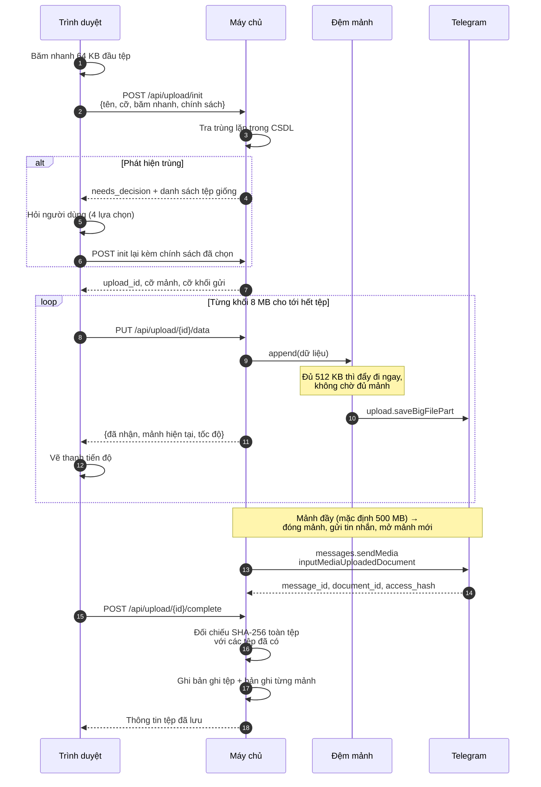
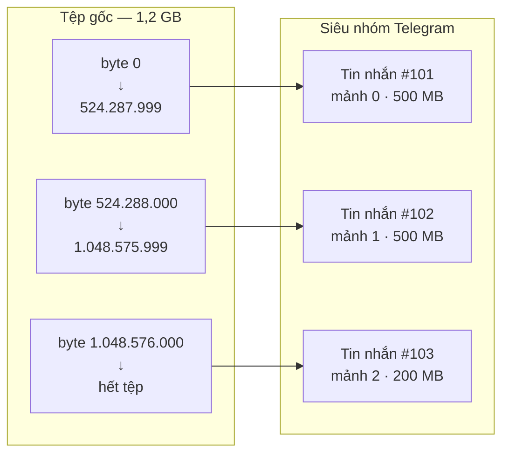
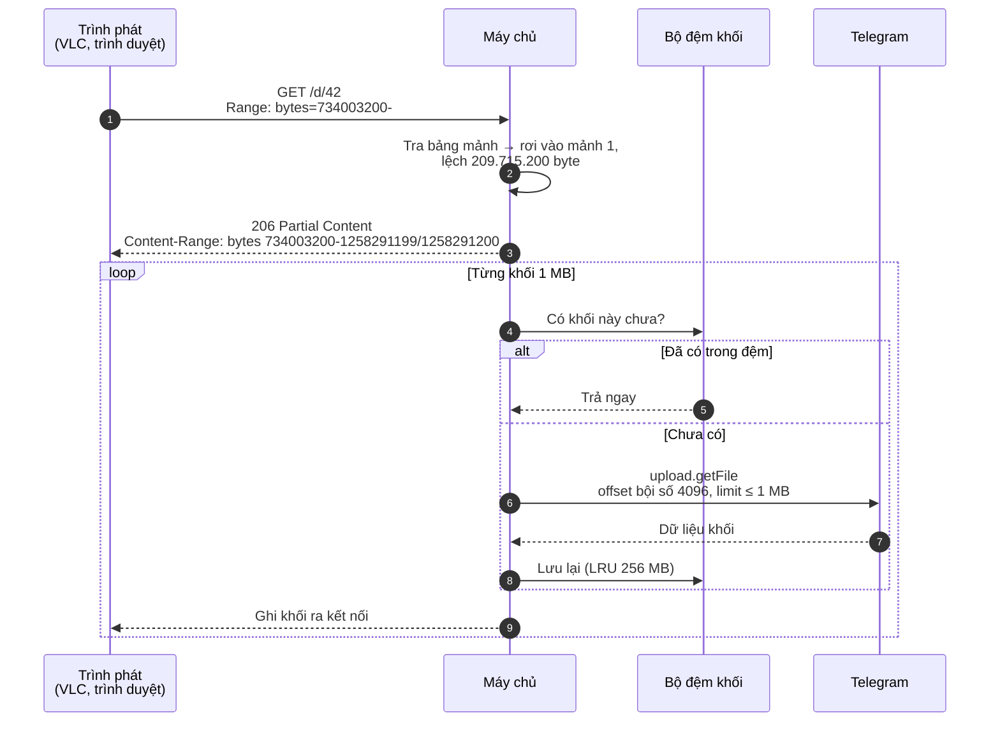
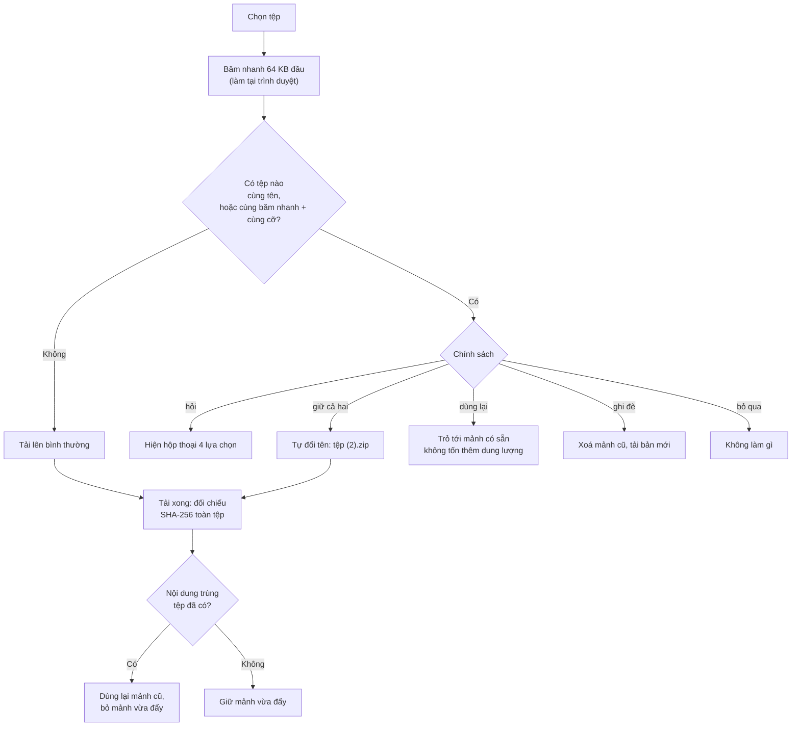
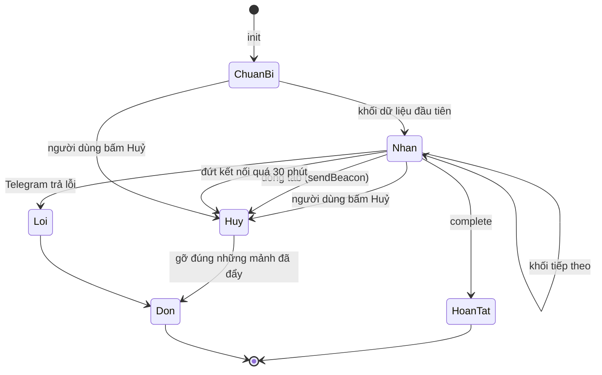
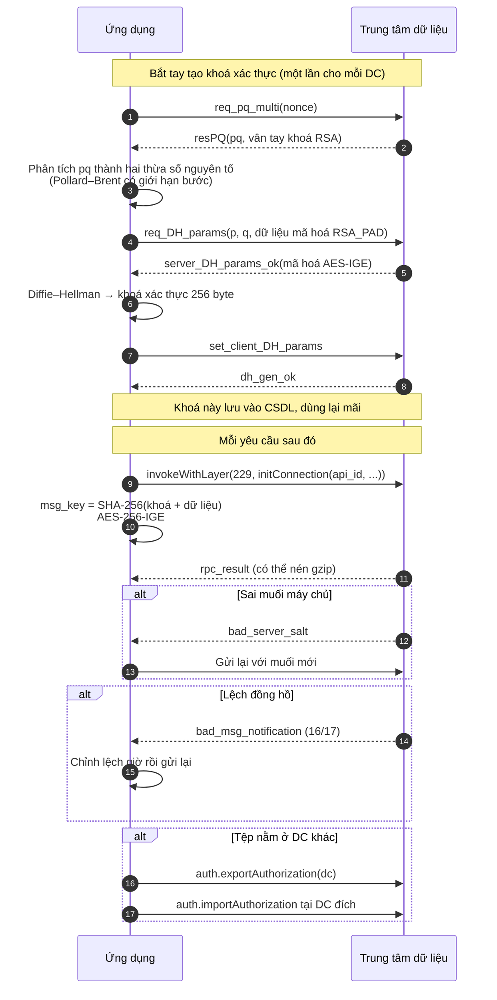
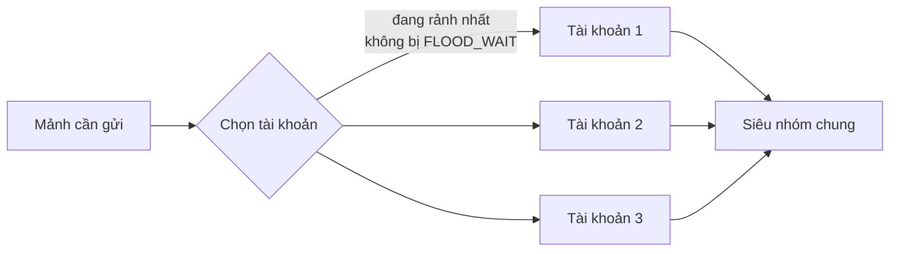
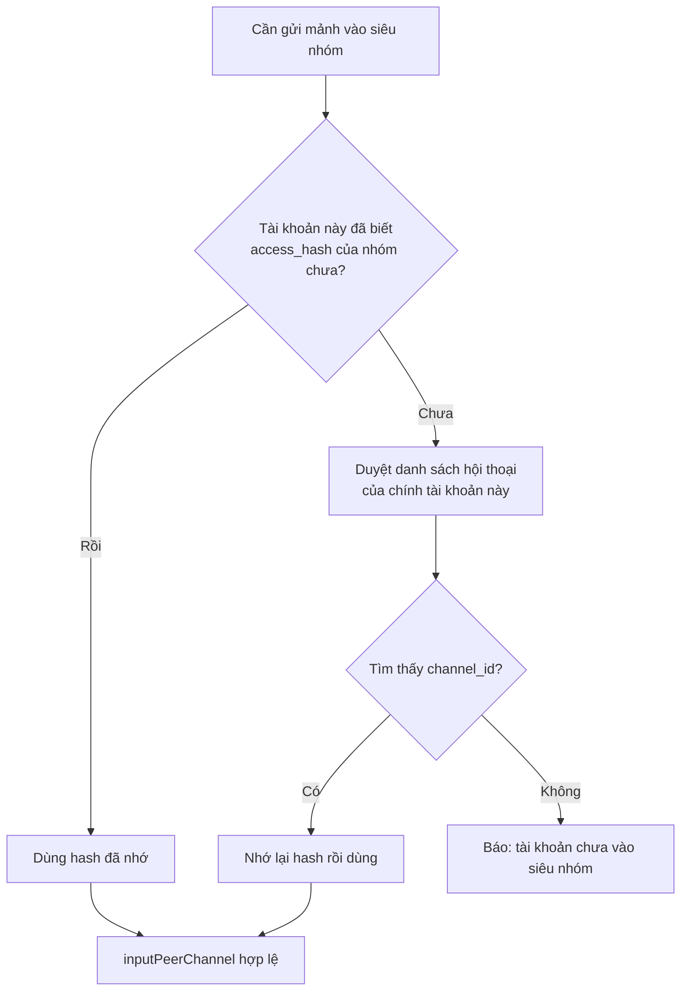
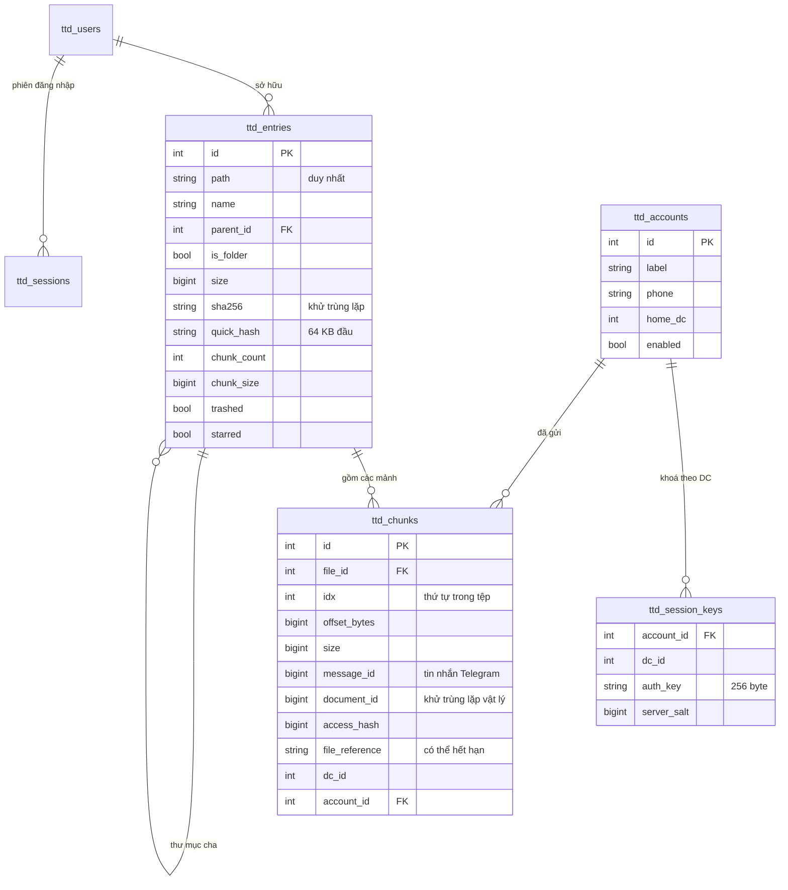

# Quy trình kỹ thuật — Tuấn's Telegram Disk

Tài liệu này mô tả ứng dụng hoạt động ra sao ở bên trong: kiến trúc, đường đi của
dữ liệu khi tải lên và tải xuống, cách nói chuyện với Telegram, cách lưu siêu dữ
liệu, và những giới hạn đã biết.

Dành cho người muốn sửa mã nguồn, tự dựng bản build, hoặc đơn giản là muốn hiểu
dữ liệu của mình đang nằm ở đâu. Nếu bạn chỉ cần dùng ứng dụng, xem
[Hướng dẫn sử dụng](HUONG-DAN-SU-DUNG.md).

---

## Mục lục

1. [Ý tưởng](#1-ý-tưởng)
2. [Kiến trúc tổng thể](#2-kiến-trúc-tổng-thể)
3. [Luồng tải lên](#3-luồng-tải-lên)
4. [Cắt mảnh và ánh xạ byte](#4-cắt-mảnh-và-ánh-xạ-byte)
5. [Luồng tải xuống và Range](#5-luồng-tải-xuống-và-range)
6. [Khử trùng lặp](#6-khử-trùng-lặp)
7. [Huỷ và dọn dẹp](#7-huỷ-và-dọn-dẹp)
8. [Tầng MTProto](#8-tầng-mtproto)
9. [Schema TL và quy tắc CRC32](#9-schema-tl-và-quy-tắc-crc32)
10. [Nhiều tài khoản](#10-nhiều-tài-khoản)
11. [Cơ sở dữ liệu](#11-cơ-sở-dữ-liệu)
12. [Bảo mật](#12-bảo-mật)
13. [Kết quả kiểm thử](#13-kết-quả-kiểm-thử)
14. [Giới hạn đã biết](#14-giới-hạn-đã-biết)

---

## 1. Ý tưởng

Telegram cho tài khoản thường gửi tệp tới **2 GB mỗi tệp** và **không giới hạn
tổng dung lượng**. Ứng dụng khai thác điều đó: cắt tệp thành từng mảnh, gửi mỗi
mảnh làm một tin nhắn tài liệu vào một siêu nhóm riêng tư của bạn, rồi ghi lại
"tệp X gồm những mảnh nào, mảnh nào nằm ở tin nhắn nào".

Telegram giữ **dữ liệu**. Ứng dụng giữ **bản đồ**. Mất bản đồ thì dữ liệu vẫn
còn trên Telegram nhưng thành một đống tệp rời rạc không tên — nên hãy sao lưu
cơ sở dữ liệu.

Ba ràng buộc định hình toàn bộ thiết kế:

| Ràng buộc | Hệ quả |
|---|---|
| Tệp có thể lớn hơn RAM của máy chủ | Không được giữ trọn tệp trong bộ nhớ ⇒ tải lên theo luồng |
| Telegram giới hạn kích thước mỗi tệp | Phải cắt mảnh, và phải ghép lại đúng thứ tự khi đọc |
| Xem phim cần tua được | Phải đọc được một khoảng byte bất kỳ mà không tải cả tệp |

---

## 2. Kiến trúc tổng thể



Toàn bộ nằm trong **một tệp thực thi duy nhất**, không phụ thuộc thư viện ngoài.
Mọi thứ đều tự viết bằng C++17: máy chủ HTTP, WebDAV, MTProto, mật mã
(SHA-1/256/512, MD5, HMAC, PBKDF2, AES-IGE/CBC/CTR, RSA, SRP, số lớn), giải nén
gzip, phân giải DNS, và cả trình điều khiển MySQL nói thẳng giao thức mạng.
Chỉ SQLite là mã nguồn bên thứ ba, được nhúng sẵn dưới dạng amalgamation.

### Bản đồ mã nguồn

```
src/
  common/     tiện ích chung — chuỗi, JSON, thời gian UTC+7, nhật ký, cấu hình
  crypto/     hàm băm, AES, số lớn, RSA, SRP, sinh số ngẫu nhiên
  compress/   giải nén DEFLATE/zlib/gzip (Telegram nén gói tin bằng gzip)
  net/        socket, DNS, địa chỉ
  tg/         TL codec, MTProto, tài khoản, nhóm tài khoản, backend nội bộ
  db/         giao diện CSDL, SQLite, MySQL (giao thức tự cài đặt)
  storage/    cắt mảnh, đệm mảnh, quản lý tải lên, đọc theo khoảng, bộ đệm khối
  http/       máy chủ HTTP, REST API, WebDAV, kiểu MIME, tài nguyên nhúng
  app/        ghép tất cả lại, người dùng, hệ thống tệp ảo
web/          giao diện — HTML, CSS, JS thuần, nhúng thẳng vào tệp thực thi
schema/       mtproto.tl và api.tl (bản chính thức, layer 229)
```

---

## 3. Luồng tải lên

Điểm mấu chốt: **dữ liệu không bao giờ nằm trọn ở đâu cả**. Trình duyệt gửi từng
phần 8 MB, máy chủ nhận được bao nhiêu đẩy thẳng lên Telegram bấy nhiêu.



### Ba chế độ đệm

Đệm mảnh (`ChunkBuffer`) quyết định dữ liệu tạm trú ở đâu giữa lúc nhận và lúc
đẩy lên Telegram:

| Chế độ | Cách làm | RAM cần | Dùng khi |
|---|---|---|---|
| `stream` *(mặc định)* | Gom đủ 512 KB là đẩy đi ngay | ~512 KB mỗi mảnh | Gần như mọi trường hợp |
| `memory` | Giữ trọn mảnh trong RAM rồi mới đẩy | Bằng cỡ mảnh | Máy nhiều RAM, muốn giải phóng trình duyệt sớm |
| `disk` | Ghi ra tệp tạm, đẩy lên từ đó | Không đáng kể | Máy ít RAM, đĩa rộng, mạng tới Telegram chậm |

Con số 512 KB không tự nghĩ ra: đó là kích thước phần (`part`) mà
`upload.saveBigFilePart` của Telegram yêu cầu.

Nhờ chế độ `stream`, một VPS 512 MB RAM vẫn tải được tệp 100 GB.

---

## 4. Cắt mảnh và ánh xạ byte

Mỗi mảnh là **một tin nhắn tài liệu** trong siêu nhóm. Bản ghi mảnh lưu đủ thứ
cần để đọc lại: vị trí trong tệp, kích thước, mã tin nhắn, mã tài liệu,
`access_hash`, `file_reference`, trung tâm dữ liệu, và tài khoản đã gửi.



Muốn đọc byte thứ *N* của tệp, ứng dụng tra bảng mảnh để biết *N* rơi vào mảnh
nào và lệch bao nhiêu trong mảnh đó — không cần tải mảnh nào khác.

### Cỡ mảnh nên đặt bao nhiêu?

| Cỡ mảnh | Ưu | Nhược |
|---|---|---|
| Nhỏ (50–100 MB) | Lỗi mạng chỉ mất một mảnh nhỏ; tua video nhạy hơn | Nhiều tin nhắn, dễ chạm giới hạn tần suất |
| **500 MB (mặc định)** | Cân bằng tốt | — |
| Lớn (1,5–1,9 GB) | Ít tin nhắn nhất | Một mảnh hỏng mất nhiều dữ liệu; ngốn RAM ở chế độ `memory` |

Giới hạn cứng khoảng **1900 MB** — cấu hình vượt sẽ bị siết lại.

---

## 5. Luồng tải xuống và Range

Đây là phần khiến "xem phim trực tiếp từ Telegram" chạy được.



Ba ràng buộc của Telegram mà tầng đọc phải tuân thủ:

1. `offset` phải là **bội số của 4096**
2. `limit` phải là **bội số của 4096** và không quá 1 MB
3. Một lần đọc **không được vắt qua ranh giới 1 MB**

Nên ứng dụng luôn quy về các khối 1 MB thẳng hàng, đọc thừa rồi cắt lại đúng
khoảng người dùng xin. Bộ đệm LRU giữ các khối vừa đọc, nhờ vậy tua tới lui
trong cùng một vùng phim không phải gọi lại Telegram.

`file_reference` do Telegram cấp sẽ **hết hạn**. Khi gặp lỗi
`FILE_REFERENCE_EXPIRED`, ứng dụng tự gọi `channels.getMessages` lấy tham chiếu
mới rồi thử lại — người dùng không thấy gì bất thường.

---

## 6. Khử trùng lặp

Kiểm tra hai vòng, vòng ngoài rẻ tiền và làm ngay trên trình duyệt:



Vòng trong (SHA-256 toàn tệp, sau khi tải xong) là lưới an toàn: hai tệp khác
tên, khác thời điểm, nhưng nội dung y hệt vẫn bị phát hiện và gộp lại.

Vì thế thống kê tách làm hai con số:

- **Tổng dung lượng đã dùng** — cộng kích thước từng tệp, con số "trên giấy tờ"
- **Chiếm thật trên Telegram** — gộp theo `document_id`, mỗi mảnh dùng chung chỉ
  tính một lần

Hai tệp 5 MB trùng nội dung ⇒ 10 MB trên giấy tờ, 5 MB thật, tiết kiệm 5 MB.

---

## 7. Huỷ và dọn dẹp

Phiên tải lên bị bỏ dở mà không dọn sẽ để lại rác trên Telegram — những mảnh
không tệp nào trỏ tới, không cách nào tìm lại. Nên mọi đường thoát đều dẫn về
cùng một chỗ dọn dẹp:



Bốn đường vào trạng thái huỷ:

| Tình huống | Cơ chế |
|---|---|
| Bấm nút **Huỷ** | `POST /api/upload/{id}/cancel` |
| Đóng tab giữa chừng | `navigator.sendBeacon` gửi lệnh huỷ lúc `beforeunload` |
| Rớt mạng, không quay lại | Bộ quét dọn phiên quá hạn (mặc định 30 phút) |
| Telegram báo lỗi | Tự dọn rồi báo lên giao diện |

Dọn dẹp chỉ gỡ **đúng những mảnh phiên đó đã đẩy lên** — không đụng mảnh dùng
chung với tệp khác. Xoá hẳn một tệp cũng theo nguyên tắc đó: mảnh nào còn tệp
khác tham chiếu thì giữ nguyên.

---

## 8. Tầng MTProto

Ứng dụng nói chuyện với Telegram bằng **MTProto 2.0**, tự cài đặt từ đầu, không
dùng TDLib hay thư viện nào khác.



Những thứ đã cài đặt đầy đủ: sinh khoá xác thực, `msg_key` với độ lệch khoá
`x=0` cho phía gửi và `x=8` cho phía nhận, muối máy chủ, mã phiên, quy tắc
`seq_no`, `msg_id` chia hết cho 4 và tăng nghiêm ngặt, gói ghép
(`msg_container`), giải nén `gzip_packed`, hàng đợi xác nhận, ping giữ kết nối,
chuyển trung tâm dữ liệu, chờ khi bị giới hạn tần suất (`FLOOD_WAIT`), và làm
mới `file_reference` khi hết hạn.

Đăng nhập hỗ trợ cả **xác thực hai lớp** — mật khẩu đám mây được xử lý bằng SRP
đúng chuẩn Telegram, không gửi mật khẩu thô đi đâu cả.

---

## 9. Schema TL và quy tắc CRC32

Telegram mô tả giao thức bằng **TL (Type Language)**. Mỗi hàm dựng có một định
danh 4 byte, chính là **CRC32 của chuỗi khai báo sau khi chuẩn hoá**:

1. Bỏ hẳn các trường điều kiện dạng `tên:flagsN.M?true`
2. Đổi kiểu `bytes` thành `string` khi nó là **kiểu trực tiếp của trường**
   (`tên:bytes`, `tên:flags.N?bytes`) — không đụng tên trường, và **không đổi**
   khi nằm trong tham số kiểu như `Vector<bytes>`
3. Đổi `<` `>` `{` `}` thành khoảng trắng rồi gộp khoảng trắng thừa
4. CRC32 của chuỗi thu được

Thứ tự hai bước giữa không hoán đổi được: bỏ ngoặc trước thì `Vector<bytes>` biến
thành hai từ rời và không còn phân biệt được với `tên:bytes` nữa.

Quy tắc này đã được đối chiếu với **toàn bộ** schema chính thức: **2510/2511**
hàm dựng khớp. Ngoại lệ duy nhất là `msg_container` — cùng vài hàm dựng lõi
MTProto khác — có định danh do đặc tả ấn định cứng chứ không suy ra từ CRC32;
bộ nạp luôn ưu tiên định danh ghi trong tệp.

Nhờ làm theo schema thay vì sinh mã cứng, **nâng layer không cần biên dịch lại**:
đặt tệp `api.tl` mới vào thư mục `schema/` là xong. Số layer khai với máy chủ tự
đọc từ chính tệp đó, nên hai bên không bao giờ lệch nhau.

Kiểm tra bất cứ lúc nào:

```bash
./tuan-telegram-disk --check-schema
```

> **Vì sao phải giữ schema cập nhật.** TL không mang thông tin độ dài, nên gặp
> một hàm dựng lạ là không thể nhảy qua nó. Bộ giải mã có hỗ trợ **giải mã một
> phần** (giữ lại các trường đã đọc được), nhưng nếu hàm dựng lạ nằm giữa một
> danh sách thì phần đứng sau nó mất trắng. Đây chính là lý do bản dùng schema
> tự viết theo layer 158 không liệt kê được siêu nhóm.

---

## 10. Nhiều tài khoản

Telegram giới hạn tần suất theo từng tài khoản. Dùng nhiều tài khoản trong cùng
một siêu nhóm vừa chia tải vừa giảm nguy cơ bị chặn.



- **Khi tải lên**: mảnh được giao cho tài khoản có ít việc đang chạy nhất, bỏ qua
  tài khoản đang trong thời gian chờ `FLOOD_WAIT`.
- **Khi tải xuống**: ưu tiên chính tài khoản đã gửi mảnh đó; nếu tài khoản ấy
  hỏng thì thử các tài khoản còn lại — vì mọi tài khoản đều ở trong cùng siêu
  nhóm nên đều đọc được.

Yêu cầu bắt buộc: **tất cả tài khoản phải là thành viên của siêu nhóm**.

### access_hash là của riêng từng tài khoản

Đây là chỗ dễ vấp nhất khi làm nhiều tài khoản, và cũng là một lỗi thật của dự
án này.

Để gửi tin nhắn vào một kênh, MTProto cần `inputPeerChannel(channel_id,
access_hash)`. Cái `channel_id` thì chung cho mọi người, nhưng **`access_hash`
được Telegram cấp riêng cho từng tài khoản**. Hash mà tài khoản A nhận được là
vô nghĩa với tài khoản B — máy chủ trả về `CHANNEL_INVALID`.

Bản đầu tiên lưu đúng một `access_hash` trong cấu hình (của tài khoản đã chọn
siêu nhóm) rồi đưa cho mọi tài khoản dùng chung. Hậu quả: mảnh nào rơi vào tài
khoản khác là hỏng cả phiên tải lên. Lỗi chỉ lộ ra khi có **từ hai tài khoản trở
lên** *và* tệp đủ lớn để sinh **nhiều mảnh** — đúng cái kịch bản mà tính năng
nhiều tài khoản sinh ra để phục vụ, nên tệp nhỏ thử bao nhiêu lần cũng không ra.



Cách làm hiện tại: mỗi tài khoản tự tìm nhóm trong danh sách hội thoại **của
chính nó** để lấy hash đúng, rồi nhớ lại theo `channel_id`. Tài khoản chưa được
mời vào nhóm sẽ báo rõ lý do thay vì mã lỗi khó hiểu, và nhóm tài khoản sẽ thử
tài khoản khác thay vì làm hỏng cả phiên.

Cùng một lý do, `access_hash` của **tài liệu** cũng theo từng tài khoản. Khi đọc
bằng tài khoản khác, tham chiếu cũ có thể không dùng được — đường làm mới
`file_reference` gọi `channels.getMessages` bằng chính tài khoản đang đọc nên tự
lấy được bộ giá trị hợp lệ.

---

## 11. Cơ sở dữ liệu

Chọn SQLite (một tệp, không cần cài gì) hoặc MySQL/MariaDB. Trình điều khiển
MySQL nói thẳng giao thức mạng nên **không cần `libmysqlclient`**; hỗ trợ cả
`mysql_native_password` lẫn `caching_sha2_password`.



Hai chi tiết nhỏ nhưng dễ sai, đã xử lý:

- **Tìm kiếm không phân biệt hoa/thường với chữ có dấu.** Hàm `lower()` sẵn có
  của SQLite không hạ được `Đ`, `Ư`, `Ế`… Ứng dụng đăng ký hàm `ttd_lower` riêng
  phủ ASCII, Latin-1, Latin mở rộng A, Ơ/Ư, khối U+1E00–U+1EFF, Hy Lạp và Kirin.
- **Đổi tên thư mục có dấu.** `substr()` của SQLite và `SUBSTRING()` của MySQL
  đếm theo **ký tự**, không theo byte. Đường dẫn cây con được cắt theo số ký tự
  UTF-8, nên đổi `Phim Tài Liệu` (18 byte) thành `K` (1 byte) vẫn giữ đúng đường
  dẫn của mọi mục con.

---

## 12. Bảo mật

| Hạng mục | Cách làm |
|---|---|
| Mật khẩu người dùng | PBKDF2-HMAC-SHA256, mặc định 200.000 vòng, muối ngẫu nhiên 16 byte |
| Phiên đăng nhập | Cookie `HttpOnly` + `SameSite=Lax`, mã phiên 32 byte ngẫu nhiên |
| So sánh bí mật | Luôn dùng so sánh thời gian hằng số |
| Mật khẩu đám mây Telegram | SRP đúng chuẩn — mật khẩu thô không rời khỏi máy |
| Truy vấn CSDL | Tham số hoá; chuỗi tiêm bị vô hiệu hoá |
| Đường dẫn | Chuẩn hoá và chặn thoát khỏi thư mục gốc (`../`) |
| Phân quyền | Người dùng thường chỉ thấy tệp của mình; quản trị viên thấy tất cả |

**Cần biết rõ:**

- Dữ liệu trên Telegram **không được mã hoá đầu-cuối**. Telegram thấy được nội
  dung các mảnh. Cần bí mật tuyệt đối thì hãy tự mã hoá tệp trước khi tải lên.
- Tệp `data/` chứa **khoá xác thực Telegram** — ai lấy được là đăng nhập được
  vào tài khoản Telegram của bạn. Đặt quyền chặt và đừng bao giờ đưa lên kho mã
  công khai.
- `config.json` chứa `api_hash`. Cũng đối xử như một bí mật.
- WebDAV qua HTTP truyền mật khẩu dạng Basic. Ra ngoài Internet thì phải đặt sau
  proxy có HTTPS.

---

## 13. Kết quả kiểm thử

### Tự kiểm tra

`./build/ttd_selftest` — **215 phép kiểm tra**, chạy tự động mỗi lần đóng gói;
thất bại là dừng build. Bao gồm các vector chuẩn của FIPS/RFC cho hàm băm, HMAC,
PBKDF2, AES; số học số lớn và RSA; quy tắc CRC32 của TL; phân tích `pq`; phân
tích HTTP; ánh xạ Range; CSDL với tên tiếng Việt; và kế toán khử trùng lặp.

### Kiểm thử đầu-cuối

Chạy trên máy dựng bản build này, qua đúng đường code thật (chỉ thay tầng vận
chuyển MTProto bằng backend lưu nội bộ):

| Hạng mục | Kết quả |
|---|---|
| Tải lên theo luồng rồi tải về, đối chiếu SHA-256 | Đạt |
| Tệp 26 MB, cỡ mảnh 4 MB → 7 mảnh, offset liền mạch | Đạt |
| Ghép 7 mảnh khi tải về, đối chiếu SHA-256 | Đạt |
| Range vắt qua ranh giới mảnh | Đạt |
| Range đuôi (`bytes=-4096`) và Range mở (`bytes=N-`) | Đạt |
| Range vượt kích thước tệp → 416 | Đạt |
| WebDAV OPTIONS · PROPFIND · GET kèm Range | Đạt |
| Bốn chính sách trùng lặp: hỏi · dùng lại · bỏ qua · giữ cả hai | Đạt |
| Huỷ giữa chừng dọn đúng số mảnh đã đẩy | Đạt |
| Xoá hẳn tệp gỡ đúng mảnh riêng, giữ mảnh dùng chung | Đạt |
| Đổi tên thư mục có dấu, đường dẫn con theo đúng | Đạt |
| Tìm kiếm không phân biệt hoa/thường với chữ có dấu | Đạt |
| Giao diện trên Chromium thật — không lỗi console | Đạt |

### Đã chạy thật với Telegram

Trên máy người dùng, không phải máy dựng bản build:

| Hạng mục | Kết quả |
|---|---|
| Bắt tay MTProto, tạo khoá xác thực với DC2 và DC5 | Đạt |
| Đăng nhập tài khoản thật, nhận mã xác thực | Đạt |
| Chuyển trung tâm dữ liệu DC2 → DC5 | Đạt |
| Liệt kê và chọn siêu nhóm lưu trữ | Đạt |
| Tải tệp 77 KB lên siêu nhóm | Đạt |
| Tải tệp 242 MB lên siêu nhóm, tốc độ ~1,65 MB/s | Đạt |
| **Tệp 1,85 GB cắt thành 4 mảnh 500 MB, đủ cả 4 mảnh** | Đạt |
| **Ba tài khoản cùng chia tải, mỗi mảnh một tài khoản** | Đạt |
| **Mỗi tài khoản tự lấy `access_hash` riêng cho siêu nhóm** | Đạt |
| Lưu khoá phiên khi thoát, không mất khoá của DC nào | Đạt |

### Chưa kiểm chứng

Những phần này **chưa ai chạy thử**, hãy coi là chưa được bảo chứng:

- **Tải về và tua video từ Telegram thật.** Đường tải lên đã chạy thật tới tệp
  1,85 GB, nhưng đường tải về mới chỉ kiểm với backend nội bộ. Ghép mảnh, Range
  và bộ đệm khối đều chạy đúng ở đó — chỗ chưa biết là `upload.getFile` với dữ
  liệu thật.
- **Chuyển tiếp khi bị `FLOOD_WAIT`**, và **làm mới `file_reference`** khi hết
  hạn. Hai đường này chỉ kích hoạt khi Telegram thực sự trả về lỗi tương ứng.
- **MySQL** làm nơi lưu siêu dữ liệu. Trình điều khiển có bộ kiểm tra riêng
  nhưng chưa chạy với máy chủ MySQL thật.
- **Xoá hẳn tệp trên Telegram thật** (`channels.deleteMessages`).

---

## 14. Giới hạn đã biết

| Giới hạn | Chi tiết |
|---|---|
| Không mã hoá đầu-cuối | Telegram đọc được nội dung các mảnh |
| Mảnh tối đa ~1900 MB | Giới hạn của Telegram cho tài khoản thường |
| Phụ thuộc cơ sở dữ liệu | Mất CSDL là mất bản đồ; dữ liệu còn trên Telegram nhưng không ghép lại được. **Hãy sao lưu.** |
| Đổi loại CSDL cần khởi động lại | Dữ liệu không tự chuyển giữa SQLite và MySQL |
| WebDAV chỉ có Basic auth | Ra Internet phải đặt sau proxy HTTPS |
| Giới hạn tần suất | Tải lên quá nhiều liên tục vẫn có thể bị `FLOOD_WAIT`; thêm tài khoản để giảm |
| Một tệp một lúc trên mỗi phiên | Tải nhiều tệp thì chạy tuần tự từng tệp |

---

## Tự dựng bản build

```bash
# Debian / Ubuntu
sudo apt install build-essential cmake
./build-linux.sh          # → dist/linux-amd64/

# Windows x64, biên dịch chéo từ Linux
sudo apt install mingw-w64 cmake
./build-windows.sh        # → dist/windows-x64/
```

Cả hai script đều chạy bộ tự kiểm tra trước khi đóng gói và dừng ngay nếu có
phép kiểm tra nào thất bại. Script Windows còn soi tệp `.exe` để chắc chắn nó
chỉ phụ thuộc DLL có sẵn của hệ điều hành (`kernel32`, `msvcrt`, `ws2_32`,
`iphlpapi`, `bcrypt`).

Số build tự tăng mỗi lần biên dịch. Nâng phiên bản bằng
`cmake --build build --target bump_minor`.

---

**Thiết kế bởi Tuandethuong.**
