# Quy trình kỹ thuật — Tuấn's Telegram Disk

Tài liệu này mổ ứng dụng ra xem bên trong có gì: kiến trúc, đường đi của từng
byte lúc lên lúc xuống, cách nói chuyện với Telegram, cách lưu bản đồ, và —
phần mà tui nghĩ đáng đọc nhất — **danh sách những chỗ đã làm sai rồi sửa**.

Vì tài liệu kỹ thuật mà chỉ kể chuyện thành công thì đọc như tờ rơi quảng cáo.
Mấy chỗ vấp mới là chỗ dạy được điều gì. Chúng nằm rải khắp tài liệu trong các
khối bắt đầu bằng **"Đã từng sai ở đây"** — ai định viết một ứng dụng tương tự
thì đọc riêng mấy khối đó trước cũng được, tiết kiệm được vài buổi tối.

Dành cho người muốn sửa mã nguồn, tự dựng bản build, hoặc chỉ tò mò dữ liệu của
mình đang nằm ở đâu. Chỉ cần dùng thôi thì qua
[Hướng dẫn sử dụng](HUONG-DAN-SU-DUNG.md), đỡ nhức đầu.

---

## Mục lục

1. [Ý tưởng](#1-ý-tưởng)
2. [Kiến trúc tổng thể](#2-kiến-trúc-tổng-thể)
3. [Luồng tải lên](#3-luồng-tải-lên)
4. [Cắt mảnh và ánh xạ byte](#4-cắt-mảnh-và-ánh-xạ-byte)
5. [Luồng tải xuống và Range](#5-luồng-tải-xuống-và-range)
6. [Khử trùng lặp](#6-khử-trùng-lặp)
7. [Huỷ, dọn dẹp và rớt mạng](#7-huỷ-dọn-dẹp-và-rớt-mạng)
8. [Tầng MTProto](#8-tầng-mtproto)
9. [Schema TL và quy tắc CRC32](#9-schema-tl-và-quy-tắc-crc32)
10. [Nhiều tài khoản](#10-nhiều-tài-khoản)
11. [Cơ sở dữ liệu](#11-cơ-sở-dữ-liệu)
12. [Bảo mật](#12-bảo-mật)
13. [Một tệp thực thi, chạy mọi nơi](#13-một-tệp-thực-thi-chạy-mọi-nơi)
14. [Kết quả kiểm thử](#14-kết-quả-kiểm-thử)
15. [Giới hạn đã biết](#15-giới-hạn-đã-biết)

---

## 1. Ý tưởng

Telegram cho tài khoản thường gửi tệp tới **2 GB mỗi tệp** và **không giới hạn
tổng dung lượng**. Nhìn con số đó xong thì khó mà không nghĩ tới chuyện biến nó
thành ổ đĩa. Ứng dụng làm đúng thế: cắt tệp thành từng mảnh, gửi mỗi mảnh làm
một tin nhắn tài liệu vào siêu nhóm riêng của bạn, rồi ghi vào sổ "tệp X gồm
mảnh nào, mảnh nào nằm ở tin nhắn số bao nhiêu".

Nói gọn: **Telegram giữ dữ liệu, ứng dụng giữ bản đồ.** Mất bản đồ thì dữ liệu
vẫn nằm nguyên trên Telegram, chỉ là thành một đống mảnh rời không tên không thứ
tự — về mặt thực dụng thì coi như mất. Nên câu quan trọng nhất của cả tài liệu
này là: **sao lưu `data/`**. Phần còn lại chỉ là chi tiết.

Ba ràng buộc, và ba ràng buộc này định hình gần như mọi quyết định phía sau:

| Ràng buộc | Hệ quả |
|---|---|
| Tệp có thể lớn hơn RAM của máy chủ | Không được giữ trọn tệp trong bộ nhớ ⇒ tải lên theo luồng |
| Telegram giới hạn kích thước mỗi tệp | Phải cắt mảnh, và ghép lại phải đúng thứ tự tới từng byte |
| Xem phim thì phải tua được | Phải đọc một khoảng byte bất kỳ mà không tải cả tệp |

Ràng buộc thứ nhất là ràng buộc khó chịu nhất. Nó cấm luôn cái cách viết dễ
nhất — nhận hết tệp vào RAM rồi mới xử lý — và bắt mọi thứ phải chạy theo
luồng, kể cả những chỗ mà chạy theo luồng phức tạp hơn hẳn.

---

## 2. Kiến trúc tổng thể

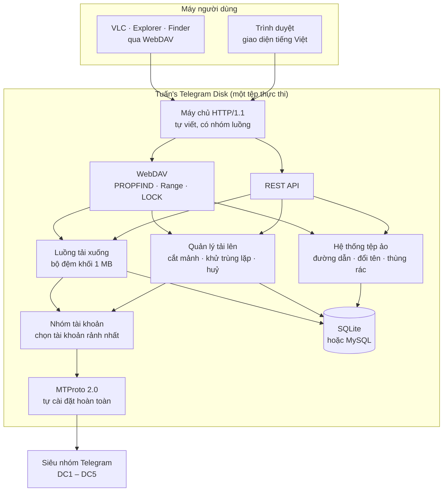

Toàn bộ nằm trong **một tệp thực thi duy nhất**, không phụ thuộc thư viện ngoài.
Mọi thứ đều tự viết bằng C++17: máy chủ HTTP, WebDAV, MTProto, mật mã
(SHA-1/256/512, MD5, HMAC, PBKDF2, AES-IGE/CBC/CTR, RSA, SRP, số lớn), giải nén
gzip, phân giải DNS, và cả trình điều khiển MySQL nói thẳng giao thức mạng.
Chỉ SQLite là mã nguồn bên thứ ba, được nhúng sẵn dưới dạng amalgamation.

### Bản đồ mã nguồn

```
src/
  common/     tiện ích chung — chuỗi, JSON, thời gian UTC+7, nhật ký, cấu hình
  crypto/     hàm băm, AES, số lớn, RSA, SRP, sinh số ngẫu nhiên
  compress/   giải nén DEFLATE/zlib/gzip (Telegram nén gói tin bằng gzip)
  net/        socket, DNS, địa chỉ
  tg/         TL codec, MTProto, tài khoản, nhóm tài khoản, backend nội bộ
  db/         giao diện CSDL, SQLite, MySQL (giao thức tự cài đặt)
  storage/    cắt mảnh, đệm mảnh, quản lý tải lên, đọc theo khoảng, bộ đệm khối
  http/       máy chủ HTTP, REST API, WebDAV, kiểu MIME, tài nguyên nhúng
  app/        ghép tất cả lại, người dùng, hệ thống tệp ảo
web/          giao diện — HTML, CSS, JS thuần, nhúng thẳng vào tệp thực thi
schema/       mtproto.tl và api.tl (bản chính thức, layer 229)
```

---

## 3. Luồng tải lên

Điểm mấu chốt: **dữ liệu không bao giờ nằm trọn ở đâu cả**. Trình duyệt gửi từng
phần 8 MB, máy chủ nhận được bao nhiêu đẩy thẳng lên Telegram bấy nhiêu. Không
có tệp tạm, không có "để tui giữ hộ một lát".

Nghe thì hiển nhiên, nhưng nó là lý do một VPS 512 MB RAM tải được tệp 100 GB.
Nếu viết theo kiểu nhận-hết-rồi-xử-lý thì tệp 100 GB cần 100 GB RAM, và bạn sẽ
gặp OOM killer sớm hơn là gặp Telegram.

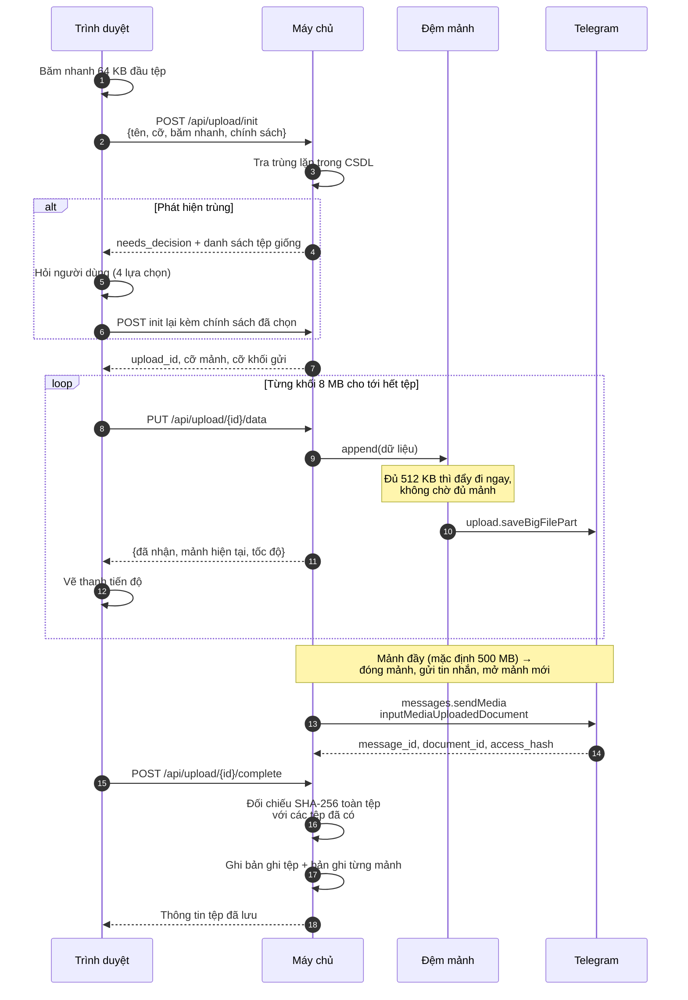

Nhật ký thật của một lượt tải, đọc từ dưới lên thấy rõ từng mảnh được đóng lại
và gửi đi — cỡ mảnh đặt 8 MB nên tệp 24,80 MB ra đúng 4 mảnh, mảnh cuối lẻ
814,62 KB:

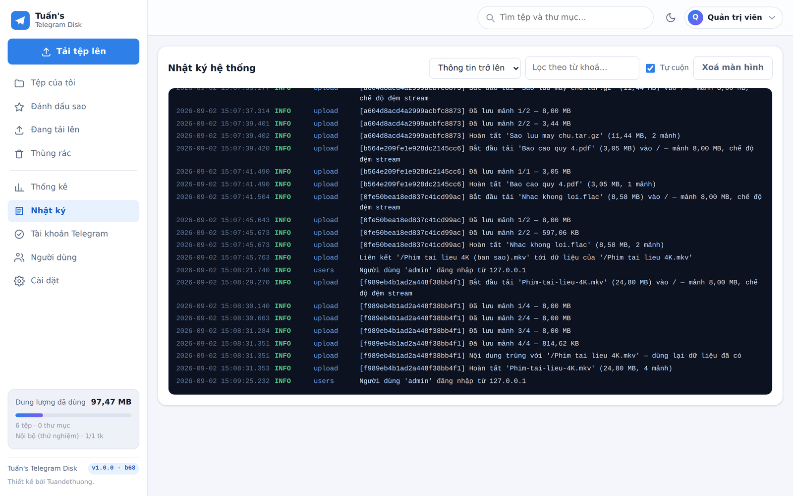

Để ý dòng gần cuối: `Nội dung trùng với '/Phim tai lieu 4K.mkv' — dùng lại dữ
liệu đã có`. Đó là lưới an toàn khử trùng lặp bắt được một tệp giống hệt **sau
khi** đã đẩy lên xong. Chi tiết ở [mục 6](#6-khử-trùng-lặp).

### Ba chế độ đệm

Đệm mảnh (`ChunkBuffer`) quyết định dữ liệu tạm trú ở đâu giữa lúc nhận và lúc
đẩy lên Telegram:

| Chế độ | Cách làm | RAM cần | Dùng khi |
|---|---|---|---|
| `stream` *(mặc định)* | Gom đủ 512 KB là đẩy đi ngay | ~512 KB mỗi mảnh | Gần như mọi trường hợp |
| `memory` | Giữ trọn mảnh trong RAM rồi mới đẩy | Bằng cỡ mảnh | Máy nhiều RAM, muốn giải phóng trình duyệt sớm |
| `disk` | Ghi ra tệp tạm, đẩy lên từ đó | Không đáng kể | Máy ít RAM, đĩa rộng, mạng tới Telegram chậm |

Con số 512 KB không phải tui bốc ra cho vui: đó là đúng kích thước phần (`part`)
mà `upload.saveBigFilePart` của Telegram đòi. Cãi lại không được.

Giao diện cho thấy đủ thứ đang diễn ra ở tầng dưới — mảnh thứ mấy trên tổng bao
nhiêu, tài khoản nào đang phục vụ, tốc độ thực, và thời gian còn lại:

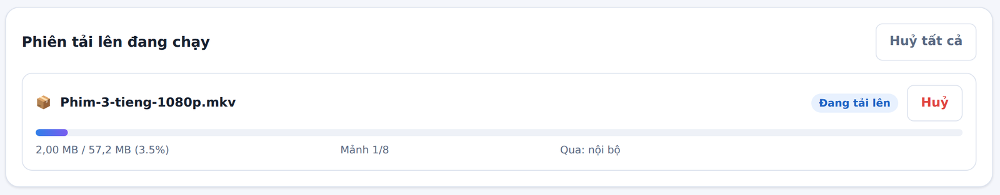

Cột **Qua:** là tài khoản đang gánh mảnh này. Nhiều tài khoản thì cột đó đổi tên
theo từng mảnh — đó là chỗ nhìn ra cơ chế chia tải ở
[mục 10](#10-nhiều-tài-khoản).

---

## 4. Cắt mảnh và ánh xạ byte

Mỗi mảnh là **một tin nhắn tài liệu** trong siêu nhóm. Bản ghi mảnh lưu đủ thứ
cần để đọc lại: vị trí trong tệp, kích thước, mã tin nhắn, mã tài liệu,
`access_hash`, `file_reference`, trung tâm dữ liệu, và tài khoản đã gửi.

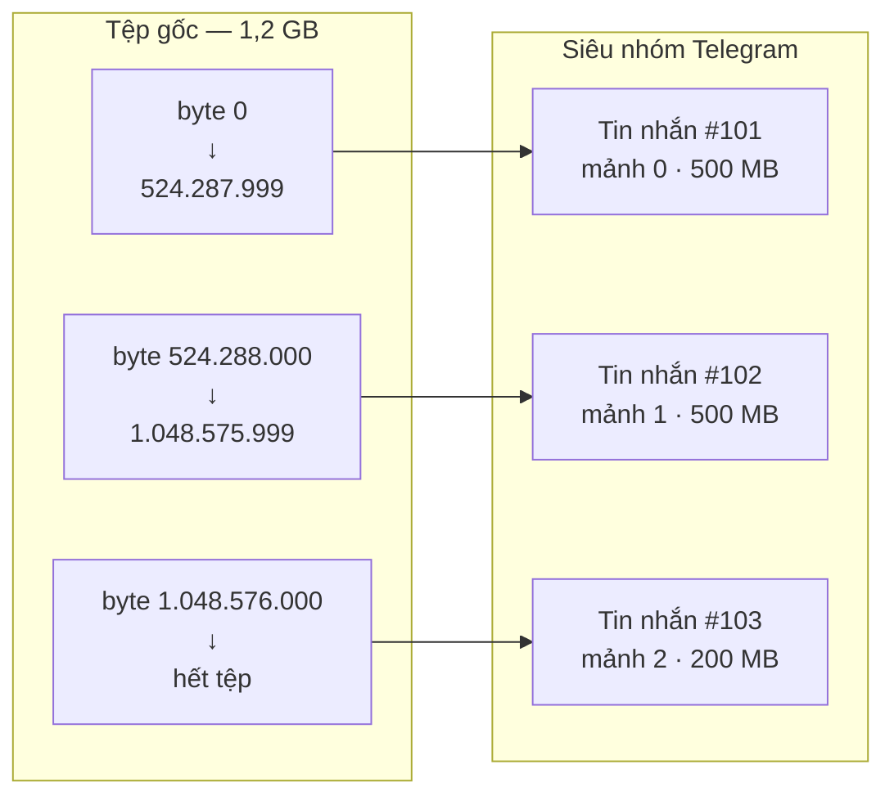

Muốn đọc byte thứ *N* của tệp, ứng dụng tra bảng mảnh để biết *N* rơi vào mảnh
nào và lệch bao nhiêu trong mảnh đó — không cần tải mảnh nào khác.

### Cỡ mảnh nên đặt bao nhiêu?

| Cỡ mảnh | Ưu | Nhược |
|---|---|---|
| Nhỏ (50–100 MB) | Lỗi mạng chỉ mất một mảnh nhỏ; tua video nhạy hơn | Nhiều tin nhắn, dễ chạm giới hạn tần suất |
| **500 MB (mặc định)** | Cân bằng tốt | — |
| Lớn (1,5–1,9 GB) | Ít tin nhắn nhất | Một mảnh hỏng mất nhiều dữ liệu; ngốn RAM ở chế độ `memory` |

Giới hạn cứng khoảng **1900 MB** — cấu hình vượt sẽ bị siết lại.

---

## 5. Luồng tải xuống và Range

Đây là phần khiến "xem phim trực tiếp từ Telegram" chạy được.

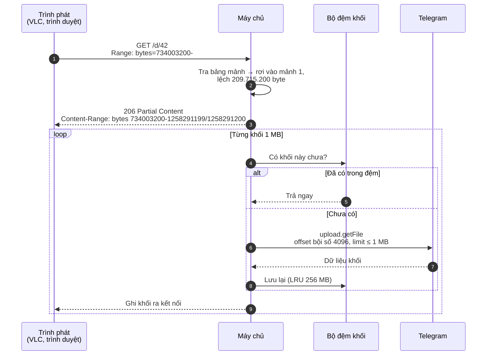

Ba ràng buộc của Telegram mà tầng đọc phải tuân thủ:

1. `offset` phải là **bội số của 4096**
2. `limit` phải là **bội số của 4096** và không quá 1 MB
3. Một lần đọc **không được vắt qua ranh giới 1 MB**

Nên ứng dụng luôn quy về các khối 1 MB thẳng hàng, đọc thừa rồi cắt lại đúng
khoảng người dùng xin. Bộ đệm LRU giữ các khối vừa đọc, nhờ vậy tua tới lui
trong cùng một vùng phim không phải gọi lại Telegram.

`file_reference` do Telegram cấp sẽ **hết hạn**. Khi gặp lỗi
`FILE_REFERENCE_EXPIRED`, ứng dụng tự gọi `channels.getMessages` lấy tham chiếu
mới rồi thử lại — người dùng không thấy gì bất thường.

### Tải về tốn bao nhiêu RAM và đĩa?

**Đĩa: không tốn gì.** Dữ liệu đi thẳng từ Telegram ra kết nối của người tải,
không qua tệp tạm nào. Đã đo: tải một tệp 1,85 GB xong, thư mục spool và cache
vẫn đúng 0 byte.

**RAM: bằng đúng cỡ bộ đệm, không phụ thuộc kích thước tệp.** Đường đọc chỉ giữ
một khối 1 MB đang xử lý; phần còn lại là bộ đệm khối LRU dùng chung cho mọi
lượt tải.

| `download_cache_bytes` | RSS lúc rảnh | RSS khi tải tệp 1,85 GB |
|---|---|---|
| 256 MB *(mặc định)* | 9 MB | 265 MB |
| 32 MB | 9 MB | ~45 MB |

Con số đứng yên dù tải lại bao nhiêu lần, và tải song song nhiều luồng cũng
không cộng dồn — bộ đệm là dùng chung.

> **Một cái bẫy của glibc.** Ứng dụng cấp phát rồi giải phóng liên tục các khối
> 1 MB. glibc có "ngưỡng mmap động": lần đầu giải phóng một vùng mmap, nó nâng
> ngưỡng lên bằng kích thước vùng đó, khiến các khối 1 MB sau này lấy từ heap và
> **không bao giờ trả lại hệ điều hành**. Đo được: tải cùng một tệp 1,85 GB sáu
> lần làm RSS leo 268 → 520 → 772 → 1024 MB, dù bộ đệm vẫn báo đúng 255/256 MB.
> Không phải rò rỉ (nó có chững lại), nhưng lãng phí thật. Ghim ngưỡng bằng
> `mallopt(M_MMAP_THRESHOLD, …)` lúc khởi động là RSS đứng yên ở 265 MB qua cả
> tám lần tải.

---

## 6. Khử trùng lặp

Nguyên tắc: **đừng bắt người ta trả tiền hai lần cho cùng một mớ byte.** Kiểm
tra hai vòng — vòng ngoài rẻ tiền và làm ngay trên trình duyệt, vòng trong đắt
hơn nhưng chắc chắn:

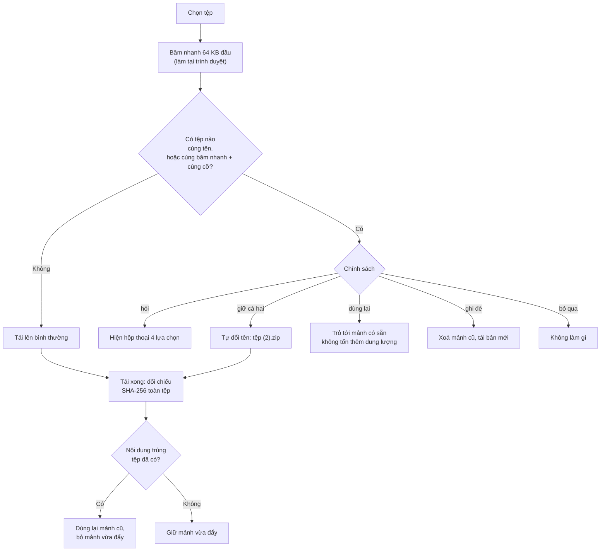

Vòng ngoài chỉ băm 64 KB đầu tệp, làm ngay trong trình duyệt trước khi gửi byte
nào lên mạng — rẻ tới mức chạy luôn cho mọi lượt tải. Nó bắt được ca phổ biến
nhất: cùng một tệp bị kéo vào hai lần.

Vòng trong là SHA-256 toàn tệp, chạy **sau khi** đã tải xong. Nghe hơi muộn,
nhưng nó bắt được ca mà vòng ngoài không thể: hai tệp khác tên, khác ngày, 64 KB
đầu khác nhau, mà nội dung thật thì y hệt. Lúc đó mảnh vừa đẩy lên bị bỏ, tệp
mới trỏ vào mảnh cũ.

Vì có hai loại "dung lượng" nên thống kê phải tách làm hai con số, và đây là chỗ
người dùng hay tưởng ứng dụng tính sai:

- **Tổng dung lượng đã dùng** — cộng kích thước từng tệp. Con số "trên giấy tờ".
- **Chiếm thật trên Telegram** — gộp theo `document_id`, mảnh dùng chung chỉ tính
  một lần. Con số "thực thu".

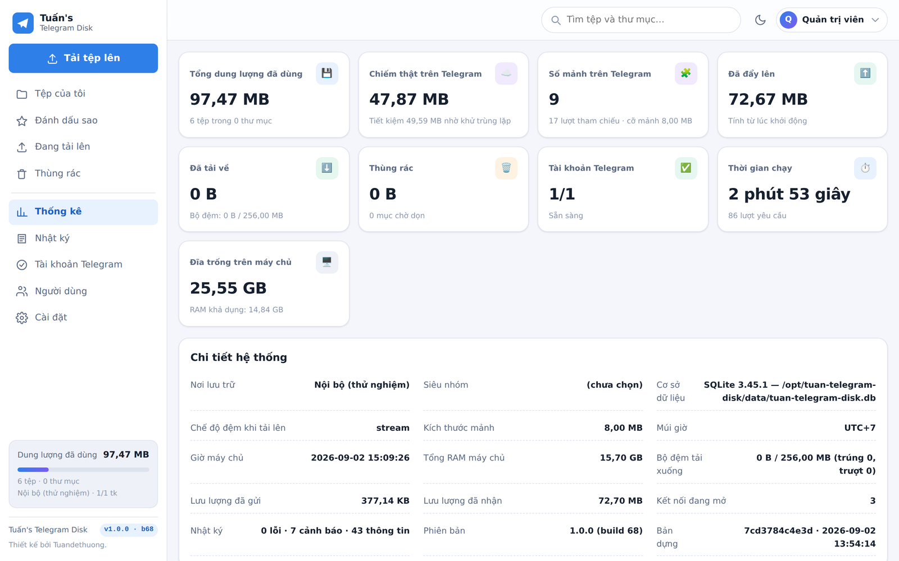

Ảnh trên là số đo thật: **72,67 MB trên giấy tờ, 47,87 MB chiếm thật, tiết kiệm
24,80 MB** — vì trong 5 tệp có một tệp là bản sao nội dung của tệp khác. Ô "Số
mảnh trên Telegram" ghi *9 mảnh · 13 lượt tham chiếu*: 9 mảnh vật lý nhưng bảng
`ttd_chunks` có 13 dòng trỏ vào chúng. Bốn dòng dư chính là tệp được liên kết
lại, và bốn dòng đó không tốn thêm một byte nào trên Telegram.

---

## 7. Huỷ, dọn dẹp và rớt mạng

Phiên tải lên bỏ dở mà không dọn sẽ để lại rác trên Telegram: những mảnh không
tệp nào trỏ tới, không cách nào tìm lại, không cách nào xoá vì bạn còn chẳng
biết chúng tồn tại. Rác kiểu đó tích lại vài tháng là siêu nhóm phình lên mà
không ai giải thích được. Nên mọi đường thoát đều bắt buộc dẫn về cùng một chỗ
dọn dẹp:

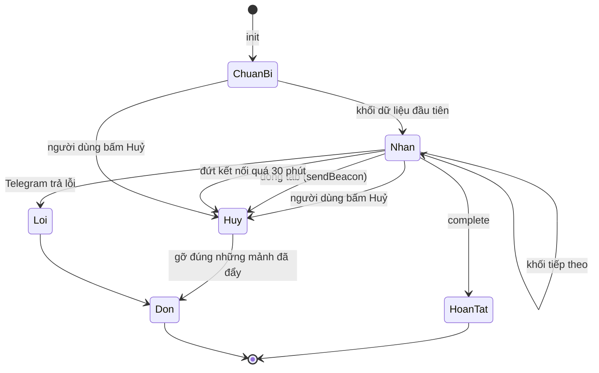

Bốn đường vào trạng thái huỷ:

| Tình huống | Cơ chế |
|---|---|
| Bấm nút **Huỷ** | `POST /api/upload/{id}/cancel` |
| Đóng tab giữa chừng | `navigator.sendBeacon` gửi lệnh huỷ lúc `beforeunload` |
| Rớt mạng, không quay lại | Bộ quét dọn phiên quá hạn (mặc định 30 phút) |
| Telegram báo lỗi | Tự dọn rồi báo lên giao diện |

Dọn dẹp chỉ gỡ **đúng những mảnh phiên đó đã đẩy lên** — không đụng mảnh dùng
chung với tệp khác. Xoá hẳn một tệp cũng theo nguyên tắc đó: mảnh nào còn tệp
khác tham chiếu thì giữ nguyên.

Một phân biệt nhỏ nhưng quan trọng: **rớt mạng không phải là huỷ.** Phiên được
giữ nguyên để nối lại; chỉ khi quá hạn không hoạt động (mặc định 30 phút) bộ
quét mới dọn. Lẫn hai thứ này là mỗi cái chớp Wi-Fi lại xoá sạch công sức nửa
tiếng của người ta.

### Rớt mạng thì sao?

Có bốn chặng đường, và cái sai kinh điển là chỉ lo chặng khó nhất rồi bỏ quên
chặng dễ nhất. Chặng dễ nhất mới là chặng hay đứt nhất:

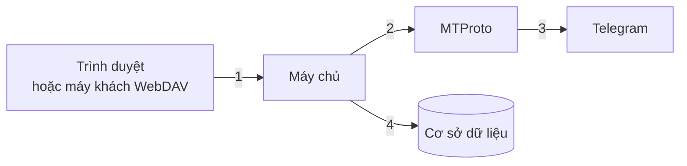

| Chặng | Khi đứt | Cách xử lý |
|---|---|---|
| 1 · trình duyệt → máy chủ | Wi-Fi chớp, máy ngủ, máy chủ khởi động lại | Thử lại 6 lần, giãn cách 1·2·4·8·16·30 giây; mỗi lần hỏi lại máy chủ đã nhận tới đâu rồi cắt tiếp từ đó |
| 1' · WebDAV → máy chủ | Máy khách WebDAV không biết gửi tiếp | Máy chủ **giữ phiên dở**; lượt PUT sau gửi lại từ đầu, máy chủ băm phần trùng để đối chiếu rồi chỉ đẩy lên Telegram phần còn thiếu |
| 2–3 · máy chủ → Telegram | Đứt TCP, hết giờ chờ, đổi trung tâm dữ liệu | Thử lại 3 lượt, giãn cách 0,5·1 giây, mở lại phiên mỗi lượt; tự theo `*_MIGRATE`; lỗi "chờ chút" ≤ 60 giây thì chờ rồi làm lại, ngân sách riêng |
| 3 · đọc mảnh | Tài khoản hỏng, tham chiếu hết hạn | Hỏi lại tham chiếu rồi đọc lại; vẫn hỏng thì lần lượt thử mọi tài khoản còn hoạt động |
| 4 · MySQL | Máy chủ CSDL ngắt kết nối nhàn rỗi | Tự kết nối lại một lần rồi chạy lại câu lệnh |

Đây là chặng 1 nhìn từ giao diện. Ảnh trên là lúc vừa đứt, ảnh dưới là sau khi
mạng trở lại — không bấm gì cả:

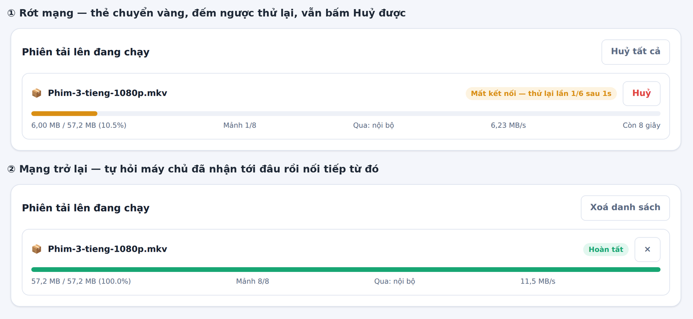

Vài chi tiết đáng để ý trong ảnh, vì mỗi cái là một quyết định thiết kế:

- Thẻ chuyển **vàng**, không phải đỏ. Đỏ nghĩa là chết, vàng nghĩa là đang xoay
  xở. Người dùng đọc màu trước khi đọc chữ.
- Nút vẫn là **Huỷ**, không phải dấu ×. Phiên đang thử lại vẫn là phiên đang
  chạy, nên vẫn phải huỷ được. Huy hiệu bên trái cũng vẫn đếm nó.
- Nó nối tiếp từ **mảnh 1/8**, không quay về 0. Máy chủ được hỏi "đã nhận tới
  đâu" rồi trình duyệt cắt tệp lại từ đúng chỗ đó.

Hai chốt chặn để **nối lại không thể làm hỏng dữ liệu** — vì nối lại sai chỗ mà
không ai phát hiện thì tệp hỏng âm thầm, còn tệ hơn là báo lỗi thẳng:

* **Web:** mỗi lượt PUT khai `X-Upload-Offset`. Lệch với số byte máy chủ đã nhận
  thì nhận ngay **409** kèm vị trí đúng. Không bao giờ có chuyện hai bên tưởng
  mình đang ở cùng một vị trí mà thật ra lệch nhau vài MB.
* **WebDAV:** phần gửi lại được băm rồi đối chiếu với tổng kiểm chốt tại đúng
  điểm đứt. Cùng tên cùng cỡ mà nội dung đã đổi thì trả **409** và bỏ phần dở,
  chứ không ghép Frankenstein hai bản vào nhau.

> **Đã từng sai ở đây — và đây là cái sai tui thấy đáng sợ nhất trong cả dự án.**
>
> `read()` trả `0` ở hai tình huống hoàn toàn khác nhau: máy khách gửi xong, và
> kết nối bị cắt ngang. Cùng một giá trị trả về, hai ý nghĩa trái ngược. WebDAV
> không phân biệt được nên nó **lưu tệp cụt thành tệp hoàn chỉnh**.
>
> Số đo lúc bắt được: gửi 9,54 MB, cắt ngang ở 4,50 MB → ổ đĩa hiện ra một tệp
> 4,50 MB, trạng thái "hoàn tất", nhìn không có gì bất thường. Không lỗi, không
> cảnh báo. Chỉ tới lúc mở tệp ra mới biết.
>
> Nay có hai lớp chặn: `BodyReader::complete()` phải báo đủ, **và** số byte nhận
> được phải bằng `Content-Length` mới cho đóng tệp. Thà trả 409 để máy khách gửi
> lại, còn hơn lưu một tệp trông lành mà bên trong mất một nửa.

### Họ lỗi "chờ chút rồi làm lại"

Telegram không chỉ có `FLOOD_WAIT_x`. Nó có cả một họ, và điểm chung là **mã lỗi
420** kèm một con số ở cuối tên:

| Định danh | Khi nào gặp |
|---|---|
| `FLOOD_WAIT_x` | Gọi API quá nhiều |
| `FLOOD_PREMIUM_WAIT_x` | **Tài khoản thường tải lên quá nhanh** — Telegram siết tốc độ và gợi ý mua Premium |
| `SLOWMODE_WAIT_x` | Siêu nhóm đang bật chế độ chậm |
| `TAKEOUT_INIT_DELAY_x` | Đang xin xuất dữ liệu |

Đúng cách xử lý là **chờ rồi làm lại**, nên họ lỗi này có ngân sách riêng, không
tiêu vào số lần thử dành cho lỗi mạng: mỗi lần chờ tối đa 60 giây, tổng thời gian
nằm chờ trong một lời gọi tối đa 180 giây. Chờ lâu hơn thì nhường cho tài khoản
khác trong nhóm.

Ở tầng HTTP, lỗi loại này trả **503 kèm `Retry-After`** thay vì 5xx chung chung.
`rclone`, `davfs2` và vòng thử lại của giao diện web đều hiểu tiêu đề đó, nên
chúng chờ đúng số giây Telegram yêu cầu thay vì tự đoán.

> **Đã từng sai ở đây, và cái sai gọn tới mức buồn cười: đúng một dòng.**
>
> ```cpp
> if (startsWith(res.error.message, "FLOOD_WAIT_")) {   // ← chỉ bắt đúng một tên
> ```
>
> `FLOOD_PREMIUM_WAIT_3` **không** bắt đầu bằng `FLOOD_WAIT_`. Nên toàn bộ cơ chế
> chờ-rồi-làm-lại mà tui viết ra để cứu những lượt tải hàng giờ… không hề chạy
> cho đúng cái lỗi mà tài khoản thường gặp thường xuyên nhất khi tải tệp lớn.
>
> Hậu quả dây chuyền, và mỗi tầng lại nhân hậu quả lên:
> 1. Lỗi rơi thẳng ra ngoài như một lỗi vĩnh viễn.
> 2. WebDAV thấy lỗi ghi thì **huỷ phiên** — xoá sạch phần đã đẩy lên.
> 3. Trả `507 Insufficient Storage`, một mã hoàn toàn sai bản chất: đây là giới
>    hạn tần suất, không phải hết chỗ.
> 4. `rclone` nhận 507, coi là lỗi thật, gửi lại **cả tệp từ byte 0**.
>
> Kết quả thật: tệp gần 1 GB chết ở phần 121/1856 vì Telegram bảo **nghỉ 3 giây**.
>
> Nay bắt theo mã 420 chứ không đoán tên; WebDAV giữ phiên lại; trả 503 kèm
> `Retry-After`. Và một chỗ nữa phải sửa mới thật sự nối lại được: `receive()`
> đánh dấu phiên là `Failed` với mọi lỗi, mà `claimResumable` chỉ nhận phiên đang
> `Receiving` — nên phiên "được giữ" vẫn không nối lại được. Giờ lỗi tạm thời giữ
> nguyên trạng thái đang nhận.
>
> Bài học: **đừng nhận diện một họ lỗi bằng cách so tên chuỗi.** Máy chủ đặt thêm
> tên mới là code câm lặng, và bạn chỉ biết khi có người gửi ảnh chụp nhật ký.

---

## 8. Tầng MTProto

Ứng dụng nói chuyện với Telegram bằng **MTProto 2.0**, tự cài đặt từ đầu, không
TDLib, không thư viện nào.

Có nên tự viết MTProto không? Nếu mục tiêu là ra sản phẩm nhanh thì không. Nhưng
ràng buộc "một tệp thực thi, giải nén là chạy" thì TDLib không đáp ứng được —
kéo nó vào là kéo theo cả một cây phụ thuộc. Nên phải tự làm, và phải làm đúng
tới từng bit, vì Telegram không tha cho lỗi nào ở tầng này: sai một byte trong
`msg_key` là kết nối bị đóng, không kèm lời giải thích.

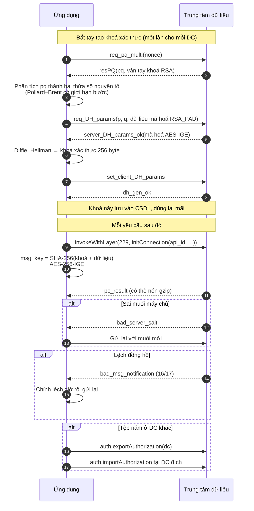

Những thứ đã cài đặt đầy đủ: sinh khoá xác thực, `msg_key` với độ lệch khoá
`x=0` cho phía gửi và `x=8` cho phía nhận, muối máy chủ, mã phiên, quy tắc
`seq_no`, `msg_id` chia hết cho 4 và tăng nghiêm ngặt, gói ghép
(`msg_container`), giải nén `gzip_packed`, hàng đợi xác nhận, ping giữ kết nối,
chuyển trung tâm dữ liệu, chờ khi bị giới hạn tần suất (`FLOOD_WAIT`), và làm
mới `file_reference` khi hết hạn.

Đăng nhập hỗ trợ cả **xác thực hai lớp** — mật khẩu đám mây được xử lý bằng SRP
đúng chuẩn Telegram, không gửi mật khẩu thô đi đâu cả.

---

## 9. Schema TL và quy tắc CRC32

Telegram mô tả giao thức bằng **TL (Type Language)**. Mỗi hàm dựng có một định
danh 4 byte, chính là **CRC32 của chuỗi khai báo sau khi chuẩn hoá**:

1. Bỏ hẳn các trường điều kiện dạng `tên:flagsN.M?true`
2. Đổi kiểu `bytes` thành `string` khi nó là **kiểu trực tiếp của trường**
   (`tên:bytes`, `tên:flags.N?bytes`) — không đụng tên trường, và **không đổi**
   khi nằm trong tham số kiểu như `Vector<bytes>`
3. Đổi `<` `>` `{` `}` thành khoảng trắng rồi gộp khoảng trắng thừa
4. CRC32 của chuỗi thu được

Thứ tự hai bước giữa **không hoán đổi được**, và đây là chỗ tui đã vấp. Bỏ ngoặc
trước thì `Vector<bytes>` biến thành hai từ rời, không còn cách nào phân biệt với
`tên:bytes` nữa — hai thứ có quy tắc chuẩn hoá trái ngược.

Quy tắc này đã đối chiếu với **toàn bộ** schema chính thức: **2510/2511** hàm
dựng khớp. Ngoại lệ duy nhất là `msg_container` — cùng vài hàm dựng lõi MTProto
khác — có định danh do đặc tả ấn định cứng chứ không suy ra từ CRC32; bộ nạp
luôn ưu tiên định danh ghi trong tệp.

> **Đã từng sai ở đây, và cái sai này tự nó còn viết ra tài liệu sai.**
>
> Bản đầu áp bước `bytes`→`string` cho **mọi** chỗ xuất hiện chữ `bytes`, kể cả
> trong `Vector<bytes>`. Kết quả: 8 hàm dựng có định danh tính ra lệch với định
> danh khai trong tệp, ứng dụng in cảnh báo mỗi lần khởi động.
>
> Chỗ đáng tiếc là phản ứng đầu tiên của tui: tui viết vào tài liệu rằng
> *"Telegram giữ định danh cũ cho tương thích"*. Nghe hợp lý, và hoàn toàn sai.
> Lúc chịu ngồi tính CRC32 bằng tay cho từng hàm dựng thì mới thấy 7 trong 8 ca
> là lỗi chuẩn hoá của chính tui. Chỉ `msg_container` là ấn định cứng thật.
>
> Bài học không phải về TL. Là về chuyện **giải thích một cảnh báo bằng giả
> thuyết dễ chịu thì rẻ hơn là đi kiểm chứng** — và tài liệu sai còn khó sửa hơn
> mã sai, vì mã thì trình biên dịch cãi lại, còn tài liệu thì không ai cãi.

Nhờ làm theo schema thay vì sinh mã cứng, **nâng layer không cần biên dịch lại**:
đặt tệp `api.tl` mới vào thư mục `schema/` là xong. Số layer khai với máy chủ tự
đọc từ chính tệp đó, nên hai bên không bao giờ lệch nhau.

Kiểm tra bất cứ lúc nào:

```bash
./tuan-telegram-disk --check-schema
```

> **Vì sao phải giữ schema cập nhật.** TL không mang thông tin độ dài, nên gặp
> một hàm dựng lạ là không thể nhảy qua nó. Bộ giải mã có hỗ trợ **giải mã một
> phần** (giữ lại các trường đã đọc được), nhưng nếu hàm dựng lạ nằm giữa một
> danh sách thì phần đứng sau nó mất trắng. Đây chính là lý do bản dùng schema
> tự viết theo layer 158 không liệt kê được siêu nhóm.

---

## 10. Nhiều tài khoản

Telegram giới hạn tần suất theo **từng tài khoản**. Nên nhiều tài khoản trong
cùng một siêu nhóm vừa chia tải vừa giảm nguy cơ bị chặn — cùng một lời hứa mà
mọi hệ thống phân tán đều hứa, và cùng một mớ rắc rối mà chúng đều mang lại.

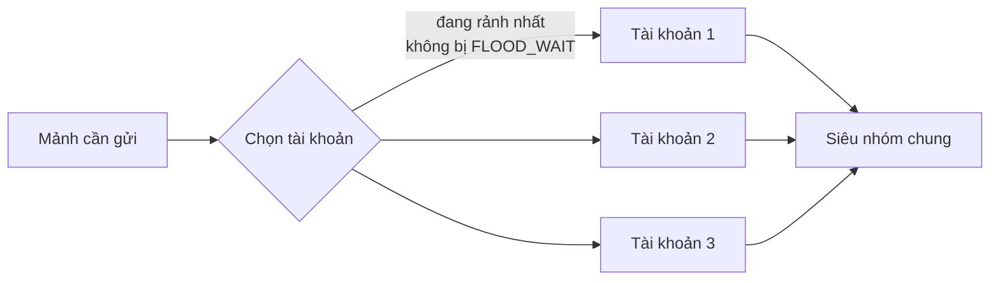

- **Khi tải lên**: mảnh được giao cho tài khoản có ít việc đang chạy nhất, bỏ qua
  tài khoản đang trong thời gian chờ `FLOOD_WAIT`.
- **Khi tải xuống**: ưu tiên chính tài khoản đã gửi mảnh đó; nếu tài khoản ấy
  hỏng thì thử các tài khoản còn lại — vì mọi tài khoản đều ở trong cùng siêu
  nhóm nên đều đọc được.

Yêu cầu bắt buộc: **tất cả tài khoản phải là thành viên của siêu nhóm**.

### access_hash là của riêng từng tài khoản

Đây là chỗ dễ vấp nhất khi làm nhiều tài khoản, và cũng là một lỗi thật của dự
án này.

Để gửi tin nhắn vào một kênh, MTProto cần `inputPeerChannel(channel_id,
access_hash)`. Cái `channel_id` thì chung cho mọi người, nhưng **`access_hash`
được Telegram cấp riêng cho từng tài khoản**. Hash mà tài khoản A nhận được là
vô nghĩa với tài khoản B — máy chủ trả về `CHANNEL_INVALID`.

Bản đầu tiên lưu đúng một `access_hash` trong cấu hình (của tài khoản đã chọn
siêu nhóm) rồi đưa cho mọi tài khoản dùng chung. Hậu quả: mảnh nào rơi vào tài
khoản khác là hỏng cả phiên tải lên. Lỗi chỉ lộ ra khi có **từ hai tài khoản trở
lên** *và* tệp đủ lớn để sinh **nhiều mảnh** — đúng cái kịch bản mà tính năng
nhiều tài khoản sinh ra để phục vụ, nên tệp nhỏ thử bao nhiêu lần cũng không ra.

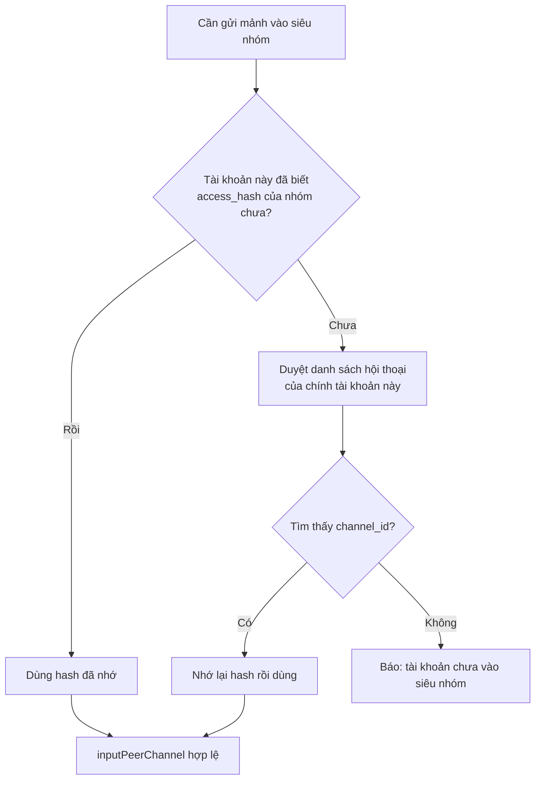

Cách làm hiện tại: mỗi tài khoản tự tìm nhóm trong danh sách hội thoại **của
chính nó** để lấy hash đúng, rồi nhớ lại theo `channel_id`. Tài khoản chưa được
mời vào nhóm sẽ báo rõ lý do thay vì mã lỗi khó hiểu, và nhóm tài khoản sẽ thử
tài khoản khác thay vì làm hỏng cả phiên.

### Một tài khoản bị khoá thì mảnh của nó có mất không?

**Không.** Dữ liệu nằm trong **siêu nhóm**, không nằm "trong" tài khoản nào. Tài
khoản chỉ là người bấm gửi; gửi xong thì tin nhắn thuộc về nhóm. Tài khoản bị
Telegram khoá, bị xoá, hay chỉ là bị tắt trong phần cài đặt của ứng dụng — mảnh
vẫn nằm nguyên đó, và **bất kỳ tài khoản nào còn trong nhóm cũng đọc được**.

Thứ duy nhất mất theo tài khoản là `access_hash` của tài liệu — cùng một lý do
với `access_hash` của kênh: Telegram cấp riêng cho từng tài khoản. Nhưng nó lấy
lại được, vì cột **`message_id`** trong bảng `ttd_chunks` mới là cái neo thật.
Từ `message_id`, `channels.getMessages` trả về `document_id`, `access_hash`,
`file_reference` và `dc_id` **hợp lệ với chính tài khoản đang hỏi**.

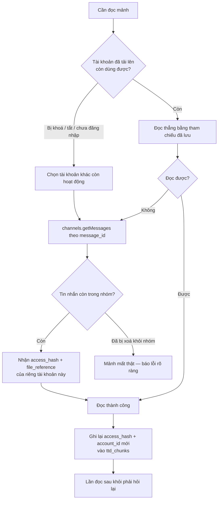

Ba tầng dự phòng trong `AccountPool::readRange`:

1. Nếu tài khoản đọc **không phải** tài khoản đã tải lên, hỏi lại tham chiếu
   **trước khi** thử — dùng lại hash của người khác thì chắc chắn bị từ chối.
2. Hỏng vì **bất kỳ** lý do gì cũng hỏi lại tham chiếu đúng một lần rồi đọc lại.
3. Vẫn hỏng thì lần lượt thử mọi tài khoản còn lại, mỗi tài khoản tự hỏi lại
   tham chiếu của riêng nó.

> **Đã từng sai ở đây.** Bản trước chỉ hỏi lại khi thông báo lỗi có chuỗi
> `FILE_REFERENCE`. Lỗi do `access_hash` của tài khoản khác lại không mang chuỗi
> đó, nên bước 2 bị bỏ qua; khi trong nhóm chỉ còn **đúng một** tài khoản thì
> bước 3 cũng rỗng và mảnh coi như đọc không được — dù chỉ cần hỏi lại một câu
> là xong. Ngoài ra `readRange` nhận `loc` là `const`, nên tham chiếu mới không
> bao giờ được ghi ngược lại cơ sở dữ liệu: khối `updateChunkReference` trong
> `storage_engine.cpp` là mã chết, và mỗi khối 1 MB trượt bộ đệm đều phải hỏi
> lại Telegram một lần nữa. Cả hai đã sửa, kèm phép tự kiểm tra chạy đúng kịch
> bản "tài khoản cũ bị khoá, tài khoản khác đọc thay".

Điều kiện duy nhất để mảnh mất thật: **tin nhắn bị xoá khỏi siêu nhóm**. Nên
đừng dọn lịch sử nhóm, và nếu đá một tài khoản ra khỏi nhóm thì nhớ **không**
chọn "xoá toàn bộ tin nhắn của thành viên này" — đó mới là thao tác xoá dữ liệu.

---

## 11. Cơ sở dữ liệu

Chọn SQLite (một tệp, không cần cài gì) hoặc MySQL/MariaDB. Trình điều khiển
MySQL nói thẳng giao thức mạng nên **không cần `libmysqlclient`**; hỗ trợ cả
`mysql_native_password` lẫn `caching_sha2_password`.

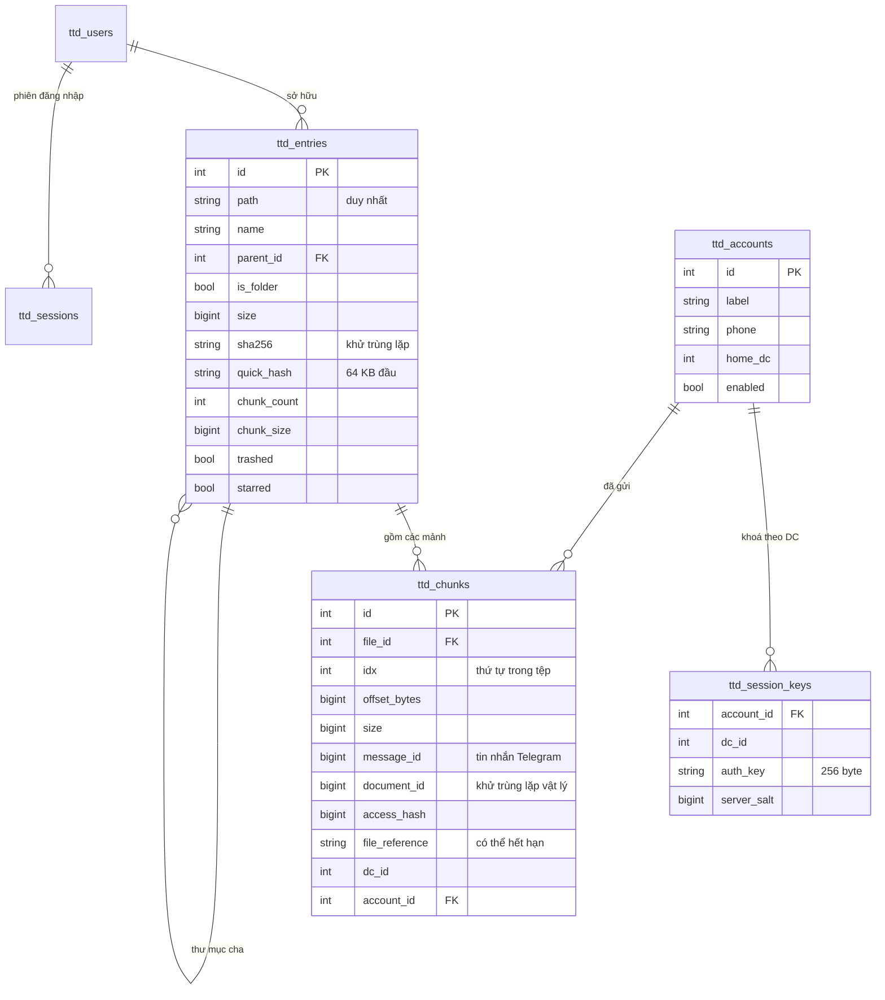

Hai chi tiết nhỏ nhưng dễ sai, đã xử lý:

- **Tìm kiếm không phân biệt hoa/thường với chữ có dấu.** Hàm `lower()` sẵn có
  của SQLite không hạ được `Đ`, `Ư`, `Ế`… Ứng dụng đăng ký hàm `ttd_lower` riêng
  phủ ASCII, Latin-1, Latin mở rộng A, Ơ/Ư, khối U+1E00–U+1EFF, Hy Lạp và Kirin.
- **Đổi tên thư mục có dấu.** `substr()` của SQLite và `SUBSTRING()` của MySQL
  đếm theo **ký tự**, không theo byte. Đường dẫn cây con được cắt theo số ký tự
  UTF-8, nên đổi `Phim Tài Liệu` (18 byte) thành `K` (1 byte) vẫn giữ đúng đường
  dẫn của mọi mục con.

---

## 12. Bảo mật

| Hạng mục | Cách làm |
|---|---|
| Mật khẩu người dùng | PBKDF2-HMAC-SHA256, mặc định 200.000 vòng, muối ngẫu nhiên 16 byte |
| Phiên đăng nhập | Cookie `HttpOnly` + `SameSite=Lax`, mã phiên 32 byte ngẫu nhiên |
| So sánh bí mật | Luôn dùng so sánh thời gian hằng số |
| Mật khẩu đám mây Telegram | SRP đúng chuẩn — mật khẩu thô không rời khỏi máy |
| Truy vấn CSDL | Tham số hoá; chuỗi tiêm bị vô hiệu hoá |
| Đường dẫn | Chuẩn hoá và chặn thoát khỏi thư mục gốc (`../`) |
| Phân quyền | Người dùng thường chỉ thấy tệp của mình; quản trị viên thấy tất cả |

**Cần biết rõ:**

- Dữ liệu trên Telegram **không được mã hoá đầu-cuối**. Telegram thấy được nội
  dung các mảnh. Cần bí mật tuyệt đối thì hãy tự mã hoá tệp trước khi tải lên.
- Tệp `data/` chứa **khoá xác thực Telegram** — ai lấy được là đăng nhập được
  vào tài khoản Telegram của bạn. Đặt quyền chặt và đừng bao giờ đưa lên kho mã
  công khai.
- `config.json` chứa `api_hash`. Cũng đối xử như một bí mật.
- WebDAV qua HTTP truyền mật khẩu dạng Basic. Ra ngoài Internet thì phải đặt sau
  proxy có HTTPS.

---

## 13. Một tệp thực thi, chạy mọi nơi

Lời hứa của dự án là "giải nén xong chạy được luôn". Giữ được lời hứa đó khó hơn
tui tưởng.

### Không phụ thuộc thư viện ngoài

Mọi thứ tự viết bằng C++17: máy chủ HTTP, WebDAV, MTProto, mật mã, giải nén
gzip, phân giải DNS, và cả trình điều khiển MySQL nói thẳng giao thức mạng. Chỉ
SQLite là mã bên thứ ba, nhúng sẵn dạng amalgamation.

Không phải vì tui thích viết lại bánh xe. Là vì mỗi thư viện thêm vào là một
dòng `NEEDED` trong tệp ELF, và mỗi dòng đó là một cách để bản build chết trên
máy người khác.

### Đường dẫn tương đối tính từ chỗ đặt tệp thực thi

`config.json` ghi `data/tuan-telegram-disk.db` thì đường dẫn đó tính từ **thư
mục chứa tệp thực thi**, không phải thư mục hiện hành. Nhờ vậy cả thư mục mang
đi USB, chạy từ đâu cũng đúng, và `systemd` khỏi phải khai `WorkingDirectory`
cho chuẩn.

### Chuyện `GLIBC_2.38 not found`

Đây là chỗ lời hứa "chạy được luôn" bị vỡ, và vỡ ở nơi tui không ngờ tới.

```
./tuan-telegram-disk: /lib/x86_64-linux-gnu/libc.so.6:
version `GLIBC_2.38' not found (required by ./tuan-telegram-disk)
```

Máy dựng có glibc 2.39, VPS thì cũ hơn. Trình biên dịch **tự** thay `sscanf`,
`strtol`, `strtoll`, `strtoul` bằng biến thể `__isoc23_*` — cần `GLIBC_2.38` —
rồi kéo thêm `arc4random` cần `GLIBC_2.36`. Không dòng mã nào của tui yêu cầu
những thứ đó; nó tự xảy ra ở tầng liên kết.

Bực nhất là cơ chế chặn *đã có sẵn*: `CMakeLists.txt` có tuỳ chọn
`TTD_FULLY_STATIC` từ đầu. Chỉ là `build-linux.sh` đặt mặc định `0`. Nên mọi gói
phát hành đều là bản liên kết động — trái hẳn với dòng "chạy độc lập" mà chính
tui viết trong README.

Nay mặc định là liên kết tĩnh hoàn toàn, và có một cổng chặn **đọc thẳng tầng
ELF** trước khi cho đóng gói:

```bash
readelf -l  "$BIN" | grep -c INTERP      # phải là 0
objdump -p  "$BIN" | grep -c NEEDED      # phải là 0
objdump -T  "$BIN" | grep -c GLIBC_      # phải là 0
```

> **Đã từng sai ở đây, hai lần liền.**
>
> Lần một: bản kiểm đầu tiên tui viết bằng `ldd | grep -q`. Nhưng `ldd` trả **mã
> thoát 1** với tệp tĩnh ("not a dynamic executable"), gặp `set -o pipefail` là
> cả phép kiểm sập, và script báo lỗi cho một bản build hoàn toàn đúng. Đọc ELF
> trực tiếp thì không có cái bẫy đó.
>
> Lần hai: cùng loại lỗi, chỗ khác. Tui bọc một lệnh trong `lệnh | tail -2` để
> in gọn đầu ra, quên rằng đường ống trả mã thoát của **lệnh cuối** — tức của
> `tail`, luôn thành công. Lệnh thất bại mà script báo là đạt.
>
> Bài học chung: **đừng để đường ống ăn mất mã thoát của lệnh mình đang kiểm.**
> Hoặc dùng `PIPESTATUS`, hoặc bắt mã thoát trước rồi mới lọc đầu ra.

Liên kết tĩnh có một cảnh báo kèm theo:

```
warning: Using 'getaddrinfo' in statically linked applications requires
at runtime the shared libraries from the glibc version used for linking
```

Cảnh báo này vô hại **trong dự án này**, và tui kiểm chứ không đoán:
`src/tg/dc_config.cpp` chỉ chứa **địa chỉ IP** của các trung tâm dữ liệu
Telegram, đúng 0 tên miền; còn `dns::resolve()` thoát sớm ngay khi thấy chuỗi IP
(`if (looksLikeIp(host)) return {host};`) nên `getaddrinfo` không bao giờ được
gọi trên đường chạy thật. Có sẵn một bộ phân giải DNS tự viết làm đường lùi.

### Bản Windows

Biên dịch chéo bằng mingw-w64 từ Linux. Script soi từng dòng `DLL Name` trong
`.exe` và chỉ cho qua nếu tất cả đều là DLL có sẵn trong Windows:

```
IPHLPAPI.DLL   KERNEL32.dll   WS2_32.dll   bcrypt.dll   msvcrt.dll
```

Không có Visual C++ Redistributable, không có gì phải cài trước.

---

## 14. Kết quả kiểm thử

### Tự kiểm tra

`./build/ttd_selftest` — **248 phép kiểm tra**, chạy tự động mỗi lần đóng gói;
thất bại là dừng build, không có chế độ "thôi bỏ qua đi". Bao gồm vector chuẩn
FIPS/RFC cho hàm băm, HMAC, PBKDF2, AES; số học số lớn và RSA; quy tắc CRC32 của
TL; phân tích `pq`; phân tích HTTP; ánh xạ Range; CSDL với tên tiếng Việt; và kế
toán khử trùng lặp.

Vài phép kiểm sinh ra từ đúng những lỗi kể ở trên, và chúng có một điểm chung:
tui đều **gỡ phần vá ra chạy thử để chắc chắn phép kiểm thật sự bắt được lỗi**.
Phép kiểm không bao giờ đỏ là phép kiểm trang trí.

| Phép kiểm | Sinh ra từ |
|---|---|
| Đọc byte thứ 8 của gói `initConnection` xem có đúng `api_id` | `CONNECTION_API_ID_INVALID` |
| 6 vector CRC32 cho hàm dựng có `Vector<bytes>` | Quy tắc chuẩn hoá `bytes`→`string` bị áp sai chỗ |
| Chốt tổng kiểm giữa chừng của `Sha256` không phá trạng thái đang băm | Nối lại tệp qua WebDAV |
| Ghi lại tham chiếu mảnh kèm `account_id` sau khi đổi tài khoản | Tài khoản bị khoá, `readRange` nhận `const` |
| Lỗi khi ghi vào CSDL đã đóng không được nói nhầm là hết bộ nhớ | `sqlite3_errmsg(nullptr)` trả `"out of memory"` |

### Kiểm thử đầu-cuối

Chạy trên máy dựng bản build này, qua đúng đường code thật (chỉ thay tầng vận
chuyển MTProto bằng backend lưu nội bộ):

| Hạng mục | Kết quả |
|---|---|
| Tải lên theo luồng rồi tải về, đối chiếu SHA-256 | Đạt |
| Tệp 26 MB, cỡ mảnh 4 MB → 7 mảnh, offset liền mạch | Đạt |
| Ghép 7 mảnh khi tải về, đối chiếu SHA-256 | Đạt |
| Range vắt qua ranh giới mảnh | Đạt |
| Range đuôi (`bytes=-4096`) và Range mở (`bytes=N-`) | Đạt |
| Range vượt kích thước tệp → 416 | Đạt |
| WebDAV OPTIONS · PROPFIND · GET kèm Range | Đạt |
| Bốn chính sách trùng lặp: hỏi · dùng lại · bỏ qua · giữ cả hai | Đạt |
| Huỷ giữa chừng dọn đúng số mảnh đã đẩy | Đạt |
| Xoá hẳn tệp gỡ đúng mảnh riêng, giữ mảnh dùng chung | Đạt |
| Đổi tên thư mục có dấu, đường dẫn con theo đúng | Đạt |
| Tìm kiếm không phân biệt hoa/thường với chữ có dấu | Đạt |
| Giao diện trên Chromium thật — không lỗi console | Đạt |
| **Cắt ngang lượt PUT WebDAV ở 4,50/9,54 MB → không lưu tệp cụt, phiên giữ nguyên** | Đạt |
| **Gửi lại: nhật ký báo "khớp tổng kiểm — nối tiếp từ 4,50 MB", SHA-256 khớp** | Đạt |
| **Gửi tệp KHÁC cùng tên cùng cỡ → 409, bỏ phần dở, không ghép lẫn** | Đạt |
| **Rớt mạng giữa lượt tải 60 MB qua trình duyệt → nối lại, SHA-256 khớp tuyệt đối** | Đạt |
| **`X-Upload-Offset` đúng → 200; sai → 409 kèm vị trí đúng** | Đạt |

Phép kiểm rớt mạng ở dòng thứ tư làm bằng cách chặn thẳng lượt PUT trong
Chromium (`route.abort('connectionfailed')`) — đường thử lại trong `web/app.js`
là đường thật, chỉ có lỗi mạng là dựng. Tệp 60 MB sau khi nối lại cho ra
SHA-256 `2aabe5af…0292ff`, khớp đúng bản gốc từng byte. Đó cũng là hai ảnh ở
[mục 7](#7-huỷ-dọn-dẹp-và-rớt-mạng).

### Đã chạy thật với Telegram

Trên máy người dùng, không phải máy dựng bản build:

| Hạng mục | Kết quả |
|---|---|
| Bắt tay MTProto, tạo khoá xác thực với DC2 và DC5 | Đạt |
| Đăng nhập tài khoản thật, nhận mã xác thực | Đạt |
| Chuyển trung tâm dữ liệu DC2 → DC5 | Đạt |
| Liệt kê và chọn siêu nhóm lưu trữ | Đạt |
| Tải tệp 77 KB lên siêu nhóm | Đạt |
| Tải tệp 242 MB lên siêu nhóm, tốc độ ~1,65 MB/s | Đạt |
| **Tệp 1,85 GB cắt thành 4 mảnh 500 MB, đủ cả 4 mảnh** | Đạt |
| **Ba tài khoản cùng chia tải, mỗi mảnh một tài khoản** | Đạt |
| **Mỗi tài khoản tự lấy `access_hash` riêng cho siêu nhóm** | Đạt |
| Lưu khoá phiên khi thoát, không mất khoá của DC nào | Đạt |

### Chưa kiểm chứng

Những phần này **chưa ai chạy thử**, hãy coi là chưa được bảo chứng:

- **Tải về và tua video từ Telegram thật.** Đường tải lên đã chạy thật tới tệp
  1,85 GB, nhưng đường tải về mới chỉ kiểm với backend nội bộ. Ghép mảnh, Range
  và bộ đệm khối đều chạy đúng ở đó — chỗ chưa biết là `upload.getFile` với dữ
  liệu thật.
- **Chuyển tiếp khi bị `FLOOD_WAIT`**, và **làm mới `file_reference`** khi hết
  hạn. Hai đường này chỉ kích hoạt khi Telegram thực sự trả về lỗi tương ứng.
- **MySQL** làm nơi lưu siêu dữ liệu. Trình điều khiển có bộ kiểm tra riêng
  nhưng chưa chạy với máy chủ MySQL thật.
- **Xoá hẳn tệp trên Telegram thật** (`channels.deleteMessages`).

---

## 15. Giới hạn đã biết

| Giới hạn | Chi tiết |
|---|---|
| Không mã hoá đầu-cuối | Telegram đọc được nội dung các mảnh |
| Mảnh tối đa ~1900 MB | Giới hạn của Telegram cho tài khoản thường |
| Phụ thuộc cơ sở dữ liệu | Mất CSDL là mất bản đồ; dữ liệu còn trên Telegram nhưng không ghép lại được. **Hãy sao lưu.** |
| Đổi loại CSDL cần khởi động lại | Dữ liệu không tự chuyển giữa SQLite và MySQL |
| WebDAV chỉ có Basic auth | Ra Internet phải đặt sau proxy HTTPS |
| Giới hạn tần suất | Tải lên quá nhiều liên tục vẫn có thể bị `FLOOD_WAIT`; thêm tài khoản để giảm |
| Một tệp một lúc trên mỗi phiên | Tải nhiều tệp thì chạy tuần tự từng tệp |

---

## Tự dựng bản build

```bash
# Debian / Ubuntu
sudo apt install build-essential cmake
./build-linux.sh          # → dist/linux-amd64/

# Windows x64, biên dịch chéo từ Linux
sudo apt install mingw-w64 cmake
./build-windows.sh        # → dist/windows-x64/
```

Cả hai script chạy bộ tự kiểm tra trước khi đóng gói và dừng ngay nếu có phép
kiểm nào đỏ. Chúng cũng chạy các cổng chặn ở
[mục 13](#13-một-tệp-thực-thi-chạy-mọi-nơi) — bản Linux phải không còn dấu vết
glibc, bản Windows phải chỉ dùng DLL có sẵn. Đừng tắt mấy cổng đó; chúng có mặt
vì tui đã từng phát hành một bản build chết ngay trên VPS.

Số build tự tăng mỗi lần biên dịch. Nâng phiên bản bằng
`cmake --build build --target bump_minor`. Máy chạy CI đặt `TTD_AUTO_BUMP=OFF`
để khỏi làm bẩn cây mã.

---

**Thiết kế bởi Tuandethuong.**
